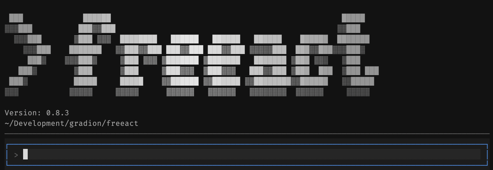

    

    
    
    
    
    

Freeact is a lightweight agent harness and CLI tool that acts by executing Python code and shell commands. Code actions are key for an agent to improve itself and its tool library.

It generates Python APIs for MCP servers and calls their tools programmatically ("code mode") instead of JSON. This enables tool composition in code actions in a single inference pass.

Freeact has a tiny core and uses sandboxed IPython kernels to execute both Python code and shell commands in a uniform way. Execution runs locally with fine-grained approval of actions.

> [!NOTE]
> **Supported models**: Freeact supports any model compatible with [Pydantic AI](https://ai.pydantic.dev/), with `gemini-3-flash-preview` as the default. See [Models](https://gradion-ai.github.io/freeact/models/) for provider configuration and examples.

## Documentation

- 📚 [Documentation](https://gradion-ai.github.io/freeact/)
- 🚀 [Quickstart](https://gradion-ai.github.io/freeact/quickstart/)
- 🤖 [llms.txt](https://gradion-ai.github.io/freeact/llms.txt)
- 🤖 [llms-full.txt](https://gradion-ai.github.io/freeact/llms-full.txt)

## Capabilities

| Capability | Description |
|---|---|
| **Code actions** | Freeact agents act via Python code and shell commands. This enables tool composition and intermediate result processing in a single LLM inference pass. |
| **Local execution** | Freeact executes code and shell commands locally in an IPython kernel provided by [ipybox](https://github.com/gradion-ai/ipybox). Data, configuration and generated tools live in local workspaces. |
| **Sandbox mode** | IPython kernels optionally run in a sandbox environment based on Anthropic's [sandbox-runtime](https://github.com/anthropic-experimental/sandbox-runtime). It enforces filesystem and network restrictions on OS-level. |
| **MCP code mode** | Freeact calls MCP server tools programmatically1) via generated Python APIs. This enables composition of tool calls in code actions with much lower latency. |
| **Tool discovery** | Tools are discovered via category browsing or hybrid BM25/vector search. On-demand loading frees the context window and scales to larger tool libraries. |
| **Tool authoring** | Agents can create new tools, enhance existing tools, or save code actions as reusable tools. This captures successful experience as executable knowledge. |
| **Agent skills** | Skills give agents new capabilities and expertise based on [agentskills.io](https://agentskills.io/). They compose naturally with code actions and agent-authored tools. |
| **Subagent delegation** | Tasks can be delegated to subagents, each using their own sandbox. It enables specialization and parallelization without cluttering the main agent's context. |
| **Action approval** | Fine-grained approval of code actions and (programmatic) tool calls from both main agents and subagents. Enables human control over potentially risky actions. |
| **Session persistence** | Freeact persists agent state incrementally. Persisted sessions can be resumed and serve as a record for debugging, evaluation, and improvement. |

## Usage

| Component | Description |
|---|---|
| **[Agent SDK](https://gradion-ai.github.io/freeact/sdk/)** | Agent harness and Python API for building freeact applications. |
| **[CLI tool](https://gradion-ai.github.io/freeact/cli/)** | Terminal interface for interactive conversations with a freeact agent. |

---

1) Freeact also supports MCP server integration via JSON tool calling, but the recommended approach is programmatic tool calling.
