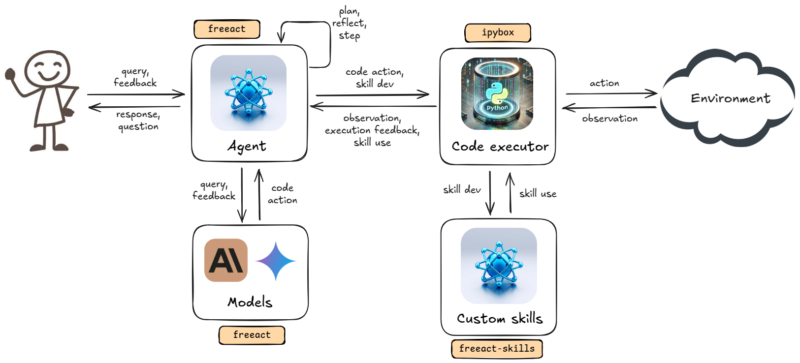
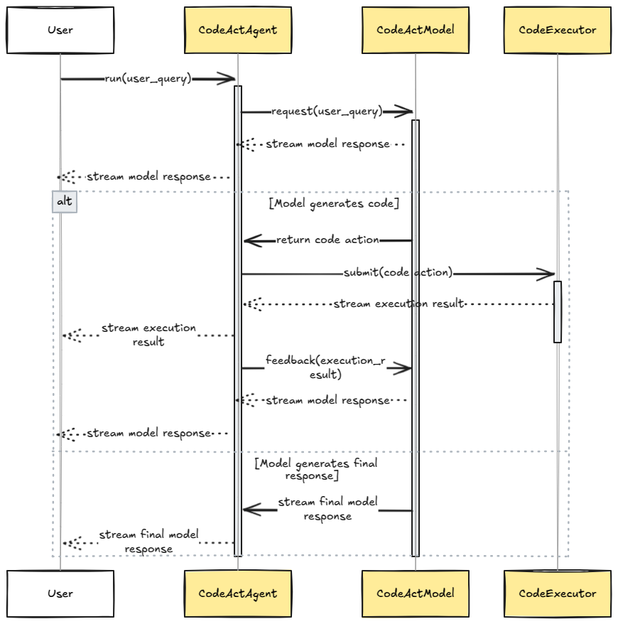

# Architecture

## Agent system

A `freeact` agent system consists of three core components:

1. An [`ipybox`](https://gradion-ai.github.io/ipybox/) execution sandbox for secure code execution. [CodeExecutionContainer][freeact.executor.CodeExecutionContainer] manages Docker container lifecycle and [CodeExecutor][freeact.executor.CodeExecutor] manages IPython kernel lifecycle within the container.
2. A code action model that generates executable Python code snippets (*code actions*) for environment interaction. All [supported models](index.md#supported-models) implement the [`CodeActModel`][freeact.model.CodeActModel] interface.
3. A `freeact` agent ([`CodeActAgent`][freeact.agent.CodeActAgent]) that orchestrates interactions between model and executor and manages user conversations through an end-to-end [streaming protocol](#streaming-protocol).

For implementation examples, see the [Basic usage](tutorials/basics.md) tutorial. Agents leverage predefined skills from [`freeact-skills`](https://gradion-ai.github.io/freeact-skills/) to extend their capabilities. They can also develop custom skills to adapt to specific environments. See the [Custom skills](skills.md) tutorial for more details.

<figure markdown>
  [{ style="display: block; margin: 0 auto" }](img/architecture.png){target="_blank"}
  <figcaption>High-level architecture of a <code>freeact</code> agent system</figcaption>
</figure>

## Streaming protocol

`freeact` implements an end-to-end streaming protocol for user-agent communication. The diagram below illustrates a simplified version of this protocol. For details, refer to:

- [`CodeActAgent`][freeact.agent.CodeActAgent] and [`CodeActAgentTurn`][freeact.agent.CodeActAgentTurn]
- [`CodeActModel`][freeact.model.CodeActModel] and [`CodeActModelTurn`][freeact.model.CodeActModelTurn]
- [`CodeExecutor`][freeact.executor.CodeExecutor] and [`CodeExecution`][freeact.agent.CodeExecution]

<figure markdown>
  [{ style="display: block; margin: 0 auto" }](img/protocol.png){target="_blank"}
  <figcaption>Streaming protocol for user-agent communication (simplified)</figcaption>
</figure>
