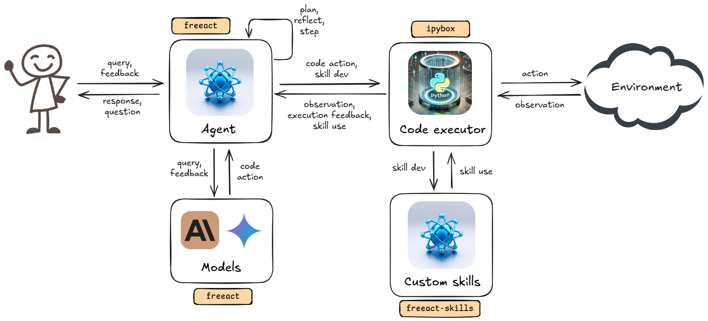

# Building Blocks

A `freeact` agent system consists of five essential components that work together to enable code-action based autonomous agents:

1. **Code action models** implement the [`CodeActModel`][freeact.model.CodeActModel] interface and either generate executable Python code snippets or produce final answers when tasks are complete. These models serve as the decision-making engine, determining what actions the agent should take based on user input, action history, environment observations, and code execution feedback. 

2. **Code action agents** orchestrate the interaction between models and the code execution environment. Built on the [`CodeActAgent`][freeact.agent.CodeActAgent] class, they coordinate code execution flow, manage multi-turn conversations with users, and operate the end-to-end [streaming protocol](streaming.md). Through cycles of action generation, execution, and feedback analysis, these agents drive an adaptive loop that enables solving open-ended tasks through dynamic solution paths.

3. A **code execution environment** provides secure, sandboxed execution of code actions through [`ipybox`](https://gradion-ai.github.io/ipybox/), a specialized runtime built on IPython and Docker. It ensures safe execution while maintaining full access to the Python ecosystem, enabling agents to leverage external libraries and custom skills as needed. The runtime is implemented by the [`executor`](api/executor.md) module and can be deployed locally or remotely.

4. **Custom Skills** are reusable code modules derived from successful code actions, optionally optimized through interactive user-agent sessions. The agent helps transform code actions into well-structured Python packages, enabling progressive capability building. These skills are stored in long-term memory, can be shared across agent instances, and iteratively improved through continued agent-human collaboration. The [`freeact-skills`](https://gradion-ai.github.io/freeact-skills/) project provides predefined skills.

5. **System Extensions** enable customization of agent behavior through natural language specifications of additional rules, constraints, and workflows. These extensions support advanced capabilities such as human-in-the-loop processes, domain-specific knowledge integration, and agent runbooks, allowing the agent to adapt to specialized use cases and operational requirements.

## Architectural overview

<figure markdown>
  [{ style="display: block; margin: 0 auto" }](img/architecture.png){target="_blank"}
  <figcaption>High-level architecture of a <code>freeact</code> agent system. It shows building blocks 1 - 4, system extensions are not shown.</figcaption>
</figure>
