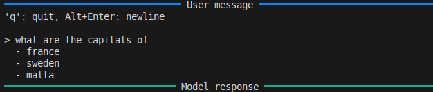

# Command line interface

`freeact` provides a minimalistic command line interface (CLI) for running agents. It is currently intended for demonstration purposes only. [Install `freeact`](installation.md) and run the following command to see all available options:

```bash
python -m freeact.cli --help
```

!!! Tip

    Check [quickstart](quickstart.md), [tutorials](tutorials/index.md) or [supported models](models.md) for usage examples.

## Multiline input

The `freeact` CLI supports entering messages that span multiple lines in two ways:

1. **Copy-paste**: You can directly copy and paste multiline content into the CLI
2. **Manual entry**: Press `Alt+Enter` (Linux/Windows) or `Option+Enter` (macOS) to add a new line while typing

To submit a multiline message for processing, simply press `Enter`.



## Environment variables

Environment variables may be required for two purposes:

1. Running skill modules in the [execution environment](environment.md#execution-environment), including:
    - [Predefined skills](https://gradion-ai.github.io/freeact-skills/)
    - [Custom skills](tutorials/skills.md)
2. Running code action models by `freeact` agents

There are three ways to provide these environment variables:

- For skill modules (purpose 1): Variables must be defined in a `.env` file in your current working directory
- For code action models (purpose 2): Variables can be provided through:
    - A `.env` file in the current working directory
    - Command-line arguments
    - Shell environment variables

This is shown by example in the following two subsections.

### Example 1

The [quickstart](quickstart.md) example requires `ANTHROPIC_API_KEY` and `GOOGLE_API_KEY` to be defined in a `.env` file in the current directory. The `ANTHROPIC_API_KEY` is needed for the `anthropic/claude-3-5-sonnet-20241022` code action model, while the `GOOGLE_API_KEY` is required for the `freeact_skills.search.google.stream.api` skill in the execution environment. Given the following `.env` file

```env title=".env"
# Required by agents that use a Claude 3.5 model as code action model
ANTHROPIC_API_KEY=...

# Required for Google Search via Gemini 2 in the execution environment
GOOGLE_API_KEY=...
```

you can launch an agent with `anthropic/claude-3-5-sonnet-20241022` as code action model, configured with a generative Google search skill implemented by module `freeact_skills.search.google.stream.api`, with the following command:

```bash
python -m freeact.cli \
  --model-name=anthropic/claude-3-5-sonnet-20241022 \
  --ipybox-tag=ghcr.io/gradion-ai/ipybox:basic \
  --skill-modules=freeact_skills.search.google.stream.api
```

The API key for the code action model can alternatively be passed as command-line argument:

```bash
python -m freeact.cli \
  --model-name=anthropic/claude-3-5-sonnet-20241022 \
  --api-key=$ANTHROPIC_API_KEY \
  --ipybox-tag=ghcr.io/gradion-ai/ipybox:basic \
  --skill-modules=freeact_skills.search.google.stream.api
```

!!! note
    Valid model names are those accepted by [LiteLLM](https://www.litellm.ai/).

### Example 2

To use models from other providers, such as [fireworks_ai/accounts/fireworks/models/deepseek-v3](https://fireworks.ai/models/fireworks/deepseek-v3), you can either provide all required environment variables in a `.env` file:

```env title=".env"
# Required for DeepSeek V3 hosted by Fireworks
DEEPSEEK_API_KEY=...

# Required for generative Google Search via Gemini 2
GOOGLE_API_KEY=...
```

and launch the agent with

```bash
python -m freeact.cli \
  --model-name=fireworks_ai/accounts/fireworks/models/deepseek-v3 \
  --ipybox-tag=ghcr.io/gradion-ai/ipybox:basic \
  --skill-modules=freeact_skills.search.google.stream.api
```

or pass the API key directly as command-line arguments:

```bash
python -m freeact.cli \
  --model-name=fireworks_ai/accounts/fireworks/models/deepseek-v3 \
  --api-key=$DEEPSEEK_API_KEY \
  --ipybox-tag=ghcr.io/gradion-ai/ipybox:basic \
  --skill-modules=freeact_skills.search.google.stream.api
```
