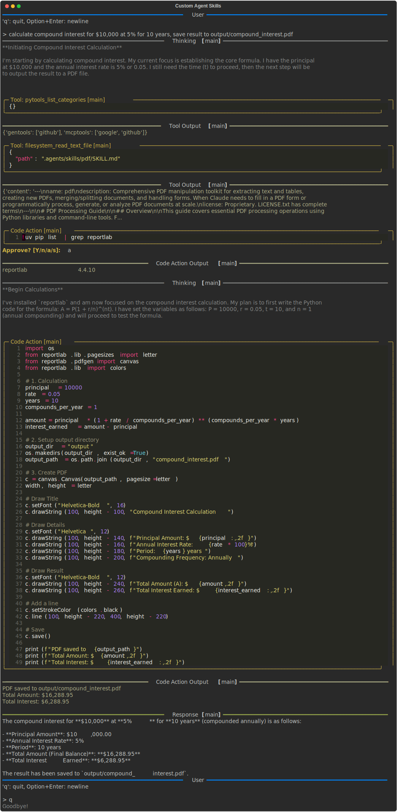

# Custom Agent Skills

Freeact supports the [agentskills.io](https://agentskills.io/) specification, a lightweight format for extending agent capabilities with specialized knowledge and workflows. Skills that guide code execution are particularly well-suited for freeact's code action approach. Skills are loaded on demand: only metadata is in context initially, full instructions load when relevant.

Custom skills are installed to `.agents/skills/` in the working directory. Bundled skills in `.freeact/skills/` are managed automatically (see [Configuration: Skills](../configuration.md#skills)).

## PDF Generation

!!! hint "Recorded session"

    A [recorded session](../recordings/agent-skills/conversation.html) of this example is appended [below](#recording).

This example uses the PDF skill from the [Anthropic skills repository](https://github.com/anthropics/skills), a collection of production-quality skills maintained by Anthropic.

Create a [workspace with a virtual environment](../installation.md#option-2-with-virtual-environment) and install the required dependencies for this example:

```bash
uv pip install reportlab
```

Install the PDF skill:

```bash
git clone https://github.com/anthropics/skills.git /tmp/skills
mkdir -p .agents/skills
cp -r /tmp/skills/skills/pdf .agents/skills/
```

Start the [CLI tool](../cli.md):

```bash
uv run freeact
```

When asked to

> calculate compound interest for $10,000 at 5% for 10 years, save result to output/compound_interest.pdf

the agent:

1. Identifies the PDF skill as relevant based on the request to create a PDF document
2. Loads the skill instructions by reading the `pdf/SKILL.md` file
3. Performs the calculation and generates a PDF following the skill's guidance

[](../recordings/agent-skills/conversation.html){target="_blank" #recording}
