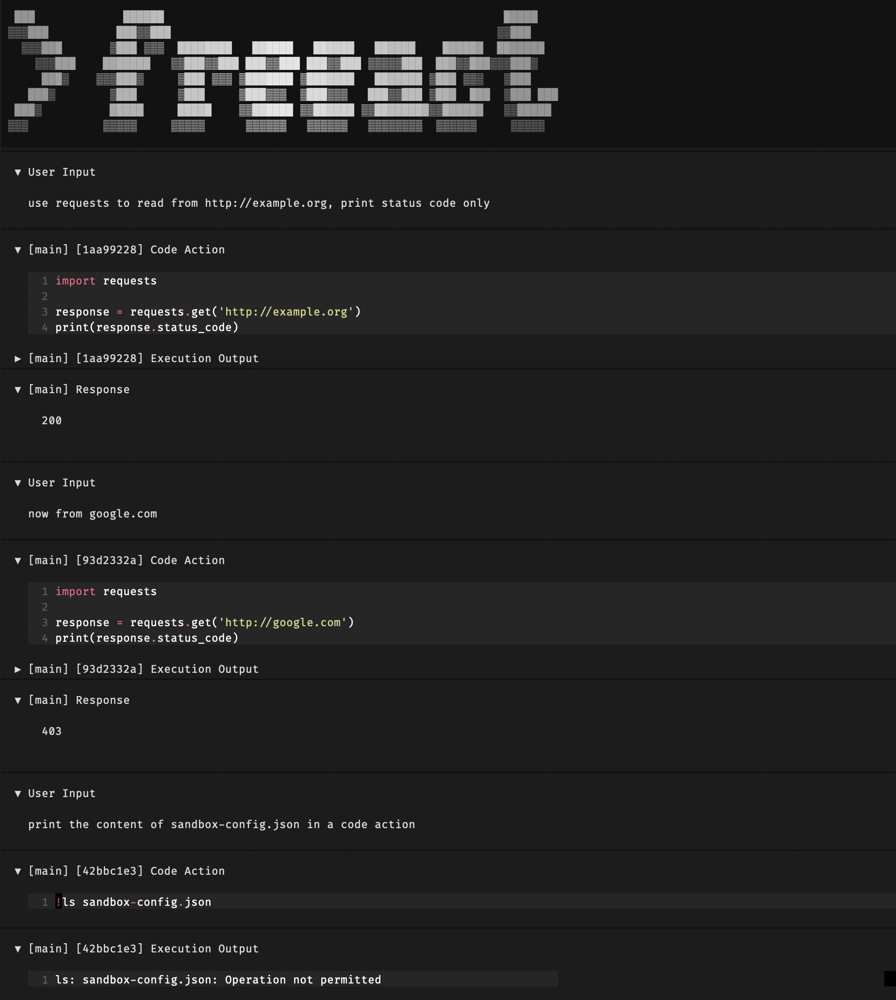

# Sandbox Mode

This example demonstrates running [code execution](../execution.md) in [sandbox mode](../sandbox.md) with a custom sandbox configuration. It does not cover [sandboxing MCP servers](../sandbox.md#mcp-servers).

Create a [workspace](../installation.md#option-1-minimal):

```bash
mkdir my-workspace && cd my-workspace
```

Create a `sandbox-config.json` file in your workspace directory:

```json title="sandbox-config.json"
--8<-- "examples/sandbox-config.json"
```

This configuration allows network access only to `example.org` and protects the sandbox config file from being read or modified. The `allowLocalBinding` and write access to `~/Library/Jupyter/` and `~/.ipython/` are required for the sandboxed IPython kernel to operate on macOS.

Start the [CLI tool](../cli.md) with the custom sandbox configuration:

```bash
uvx freeact --sandbox --sandbox-config sandbox-config.json
```

The screenshot [below](#recording) demonstrates the sandbox in action. First, the agent can access the allowed domain:

> use requests to read from example.org, print status code only

This succeeds with status `200`. Other domains are blocked:

> now from google.com

This fails with a `403 Forbidden`. The sandbox also protects the config file:

> print the content of sandbox-config.json in a code action

This fails with a `PermissionError`.

[](../screenshots/sandbox-mode.png){ target="_blank" rel="noopener" #recording}
