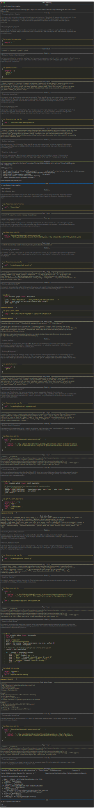

# Task Planning

Task planning is provided by a specialized [agent skill](agent-skills.md) that can be extended, modified, or replaced based on application requirements.

The essential pattern: iterate with the user on the plan, updating the persisted confirmed plan at each step.

## Example

The following recording shows the agent creating and executing a plan to find repository commits:

{target="_blank"}

Key elements:

- **Iterate on plan**: Agent presents a plan, user confirms or requests modifications
- **Persist updates**: Plan is saved to `.freeact/plans/` and updated as steps complete
- **Track progress**: Completed steps are marked `[x]` in the plan file
