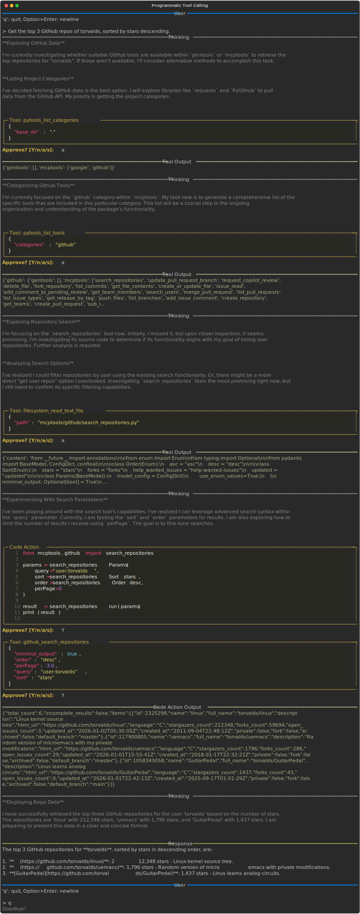

# Programmatic Tool Calling

Freeact auto-generates typed Python modules from MCP tool schemas, enabling agents to call tools programmatically within code actions rather than through JSON structures.

## How It Works

When you configure an MCP server under `ptc-servers` in `.freeact/servers.json`, freeact generates Python APIs at startup:

1. Connects to the MCP server and fetches tool schemas
2. Generates typed Python modules in `mcptools/<server_name>/`
3. Each tool becomes an importable module with `Params` class and `run()` function

The agent can then write code that imports and uses these tools directly.

## Configuration

Add MCP servers to the `ptc-servers` section in `.freeact/servers.json`:

```json
{
  "ptc-servers": {
    "github": {
      "url": "https://api.githubcopilot.com/mcp/",
      "headers": {"Authorization": "Bearer ${GITHUB_API_KEY}"}
    }
  }
}
```

Set the required environment variable:

```bash
export GITHUB_API_KEY="your-github-token"
```

## Generated APIs

After startup, `mcptools/github/` contains modules like:

```
mcptools/github/
├── __init__.py
├── search_repositories.py
├── list_commits.py
├── get_file_contents.py
└── ...
```

Each module provides:

- `Params`: A Pydantic model for typed parameters
- `run(params)`: Function that executes the tool and returns results
- Enums and nested models as needed

Example generated API (`search_repositories.py`):

```python
from enum import Enum
from pydantic import BaseModel

class Order(Enum):
    asc = "asc"
    desc = "desc"

class Sort(Enum):
    stars = "stars"
    forks = "forks"
    updated = "updated"

class Params(BaseModel):
    query: str
    sort: Sort | None = None
    order: Order | None = None
    perPage: int | None = None

def run(params: Params) -> dict:
    ...
```

## Example Session

The following recording shows the agent using programmatic tool calling to query GitHub repositories:

[](../recordings/programmatic-tools/conversation.html){target="_blank"}

Key steps in the recording:

1. **Tool discovery**: Agent lists available categories with `pytools_list_categories`
2. **Category exploration**: Agent lists tools in the `github` category
3. **API inspection**: Agent reads `mcptools/github/search_repositories.py` to understand parameters
4. **Code action**: Agent writes Python code importing from `mcptools.github`:

```python
from mcptools.github import search_repositories

params = search_repositories.Params(
    query="user:torvalds",
    sort=search_repositories.Sort.stars,
    order=search_repositories.Order.desc,
    perPage=3
)

result = search_repositories.run(params)
print(result)
```

## Progressive Loading

Tool information loads progressively to minimize context usage:

1. **Startup**: Only tool locations are known (`mcptools/` and `gentools/`)
2. **Category listing**: Category names (server names like `github`, `google`) load on demand
3. **Tool listing**: Tool names within a category load on demand
4. **API loading**: Full API definitions load when the agent reads the source file

This means an agent with access to dozens of MCP servers only loads the specific tools it needs for the current task.

## Comparison with JSON Tool Calls

| Aspect | Programmatic (PTC) | JSON Tool Calls |
|--------|-------------------|-----------------|
| Call style | Python imports and function calls | JSON structures |
| Multiple tools | Single code block with loops/conditionals | Multiple inference rounds |
| Type safety | Pydantic models with IDE support | Schema validation |
| Intermediate processing | Process results in same code block | Requires additional turns |

Programmatic tool calling is particularly effective when:

- Multiple related tools need to be called in sequence
- Results need filtering, sorting, or transformation
- Conditional logic determines which tools to call
- The task benefits from Python's expressiveness
