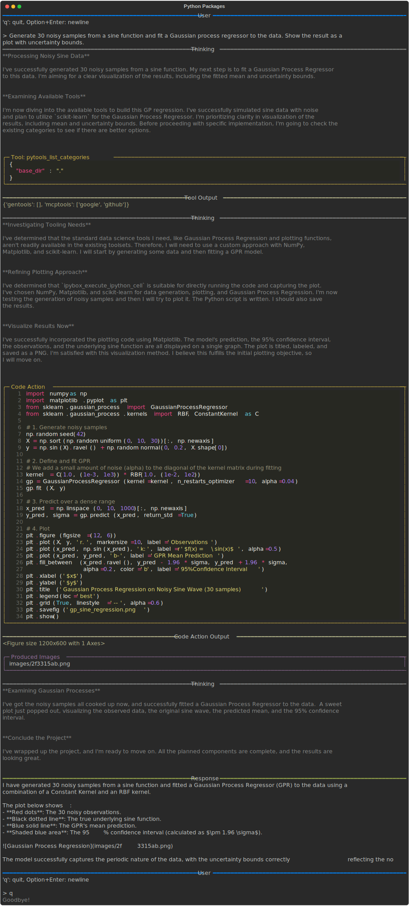

# Python Packages

The agent can use any Python packages installed in the environment. Common packages for data science and visualization work seamlessly within code actions.

## Installing Packages

Install packages using uv:

```bash
uv add matplotlib scikit-learn pandas numpy
```

Or with pip:

```bash
uv pip install matplotlib scikit-learn pandas numpy
```

Packages become available immediately to the agent's code execution kernel.

## Example: Data Visualization

The following recording demonstrates using matplotlib and scikit-learn to fit a Gaussian process regressor to noisy sine wave data:

[](../recordings/python-packages/conversation.html){target="_blank"}

Key steps in the recording:

1. **Data generation**: Agent creates noisy samples from a sine function
2. **Model fitting**: Agent fits a Gaussian process regressor to the data
3. **Visualization**: Agent generates a plot showing the fit with uncertainty bounds
4. **Output**: Plot is saved to the `images/` directory

The generated plot shows the GPR mean prediction with 95% confidence bounds:


## Image Output

When the agent generates plots, they are saved to the configured images directory (default: `images/`). The agent reports the saved file path in its response.

Common visualization packages that work with freeact:

- **matplotlib**: General-purpose plotting
- **seaborn**: Statistical data visualization
- **plotly**: Interactive charts
- **altair**: Declarative visualization

## Package Recommendations

For typical data science workflows:

| Task | Packages |
|------|----------|
| Data manipulation | pandas, polars |
| Numerical computing | numpy, scipy |
| Machine learning | scikit-learn, xgboost |
| Visualization | matplotlib, seaborn |
| HTTP requests | requests, httpx |
| PDF generation | reportlab, pypdf |
