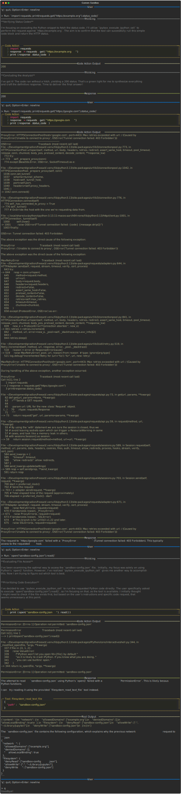

# Sandboxing Example

This example demonstrates custom sandbox configuration. See [Sandbox Mode](../sandbox.md) for configuration details.

## Custom Network Restrictions

The following recording demonstrates sandboxing with custom network restrictions. The configuration allows access to `example.org` while blocking all other external domains:

{target="_blank"}

Key steps in the recording:

1. **Allowed request**: Agent fetches `example.org` successfully (returns 200)
2. **Blocked request**: Agent attempts `google.com`, fails with network error
3. **Protected file**: Agent cannot read the sandbox config file itself
