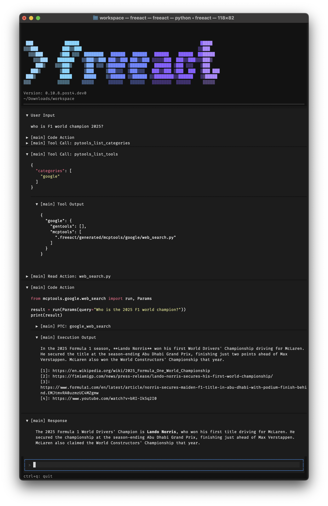
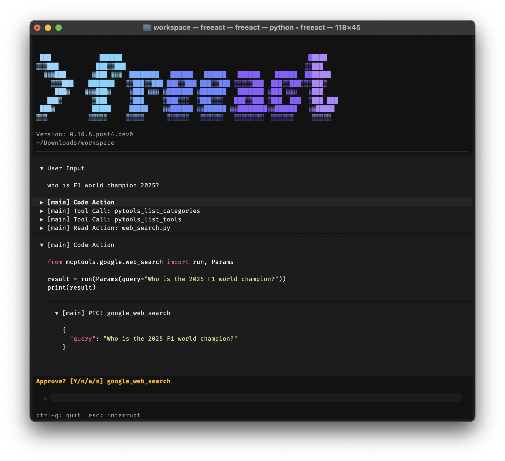

# CLI quickstart

This tutorial runs a first task with the freeact [CLI tool](../reference/cli.md): initialize a workspace, enable tool presets, start the agent, and approve its actions.

## 1. Initialize a workspace

Create a workspace directory, set your API key, and initialize the `.freeact/` configuration directory:

```bash
mkdir my-workspace && cd my-workspace
echo "GEMINI_API_KEY=your-api-key" > .env
uvx freeact init
```

See [Installation](installation.md) for alternative setup options and sandbox mode prerequisites.

!!! tip "Using a different model"

    The current default model is `google-gla:gemini-3.6-flash`. Freeact supports any model compatible with Pydantic AI. To switch providers or configure model settings, see [Configure models](../guides/models.md).

## 2. Enable tools

By default, code execution, filesystem tools, and basic tool discovery are enabled. The bundled web tool servers are one-line opt-ins in `.freeact/config.toml`. For this task, enable web search by uncommenting the corresponding line under `[agent.tools]`:

```toml title=".freeact/config.toml"
[agent.tools]
search = true            # google search (code mode); needs GEMINI_API_KEY
```

See [Add custom tool servers](../guides/tool-servers.md) for all presets and custom MCP servers, and [Configuration](../reference/configuration.md) for the full file format.

## 3. Start the agent

Start the agent:

```bash
uvx freeact
```

On start, the CLI tool auto-generates Python APIs for [configured](../guides/tool-servers.md#add-servers-for-programmatic-tool-calling) MCP servers. For example, it creates `.freeact/generated/mcptools/google/web_search.py` for the `web_search` tool of the bundled `google` MCP server, enabled by the `search` preset. With the generated Python API, the agent can import and call this tool programmatically.

!!! tip "Custom MCP servers"

    For calling the tools of your own MCP servers programmatically, add them to the [`ptc_servers`](../guides/tool-servers.md#add-servers-for-programmatic-tool-calling) section in `.freeact/config.toml`. Freeact auto-generates a Python API for them when the CLI tool starts.

## 4. Run a task

With this setup and a question like

> who is F1 world champion 2025?

the CLI tool should produce an end result similar to the following screenshot:

[](../screenshots/quickstart.png){ target="_blank" rel="noopener" }

The screenshot shows:

- **Progressive tool loading**: The agent progressively loads tool information: lists categories, lists tools in the `google` category, then reads `web_search.py` to understand the generated interface.
- **Programmatic tool calling**: The agent writes Python code that imports the `web_search` tool from `mcptools.google` and calls it programmatically (PTC) with the user's query.

The code execution output shows the search result with source URLs. The agent response is a summary of it.

## 5. Approve actions

Freeact can prompt for approval before running code actions. Shell commands and programmatic tool calls within code actions are intercepted during execution and approved individually. The screenshot below shows the approval prompt for a programmatic tool call (PTC):

[](../screenshots/quickstart-approve.png){ target="_blank" rel="noopener" }

Code actions and tool calls can also be pre-approved. See [Manage permissions](../guides/permissions.md) for prompt options and saving permission rules.

## Next steps

- Build the same task programmatically: [First agent with the SDK](sdk-tutorial.md)
- Understand what the agent executes: [Code actions](../concepts/code-actions.md)
- Run code execution with OS-level restrictions: [Use sandbox mode](../guides/sandbox.md)
