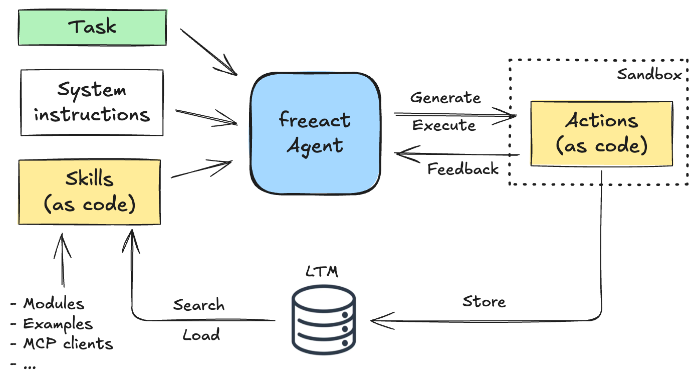

# Introduction

`freeact` is a lightweight AI agent library using Python as the common language to define executable actions and tool interfaces.
This is in contrast to traditional approaches where actions and tools are described with JSON.

A unified code-based approach enables `freeact` agents to reuse actions from earlier steps as tools or *skills* in later steps. 
This design allows agents to build on their previous work and compose more complex actions from simpler ones.[^1]

<figure markdown>
  [{ align="center" width="80%" }](img/introduction.png){target="_blank"}
  <figcaption>A unified code-based approach for defining actions and skills.</figcaption>
</figure>

## Overview

`freeact` agents are LLM agents that:

- generate *code actions* in Python instead of function calls in JSON[^2]
- act by executing these code actions in a [sandboxed environment](environment.md)
- use tools described through code and docstrings rather than JSON
- can use any feature from any Python package as tool definitions
- can store code actions as [reusable skills in long-term memory](skills/collaborative-learning.md)
- can use these skills as tools in code actions and improve on them
- support invocation and composition of [MCP tools in code actions](mcp-integration.md)

!!! Info "Supported models"

    `freeact` supports usage of any LLM from any provider as code action model via [LiteLLM](https://github.com/BerriAI/litellm).

!!! Info "Sponsored by"
    

## Motivation

Most LLMs today excel at understanding and generating code. 
It is therefore a natural choice to provide agents with tool specifications described in plain Python source code.
This is often source code of modules that provide the interfaces or facades of larger packages, rather than implementation details that aren't relevant for tool usage.
This code-based approach enables `freeact` agents to go beyond simple function calling. 
By formulating actions as code, they can instantiate classes that are part of tool definitions, use their methods for stateful processing, or [act on complex result types](skills/predefined-skills.md) that not only provide data but also expose behavior via methods on them. 

Because tool interfaces and code actions share the same programming language, tools can be natively included and composed into code actions. 
Another advantage of this approach is that code actions generated at one step can be reused as tools in later steps.
This allows `freeact` agents to learn from past experiences and compose more complex actions from simpler ones.
We prefer using the term *skills* instead of *tools* throughout our documentation, to convey their greater generality.

[^1]: This approach became popular with the [Voyager](https://arxiv.org/abs/2305.16291) paper where it was applied to Minecraft playing agents.
[^2]: Code actions can significantly outperform JSON-based approaches, showing up to 20% higher success rates as shown in the [CodeAct](https://arxiv.org/abs/2402.01030) paper.
