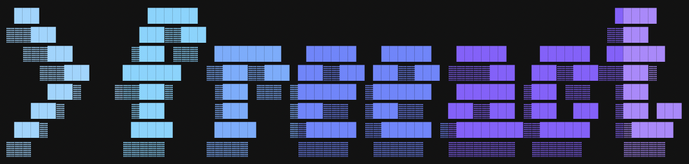

  { style="width: 100%;" }

# freeact

Freeact is a general-purpose AI agent that acts through a unified execution interface for Python code, shell commands, and programmatic MCP tool calls.

## Overview

Freeact is a lightweight, general-purpose agent that acts by executing code and shell commands in a stateful execution environment provided by [ipybox](https://github.com/gradion-ai/ipybox). A unified execution interface enables the agent to combine Python code, shell commands, and programmatic MCP tool calls within a code action, generated in one LLM inference pass, reducing the number of roundtrips.

For programmatic MCP tool calling ("code mode"), freeact generates typed Python APIs from MCP server schemas. The agent inspects generated APIs prior to execution and composes them based on available type information. Successful code actions can be saved as reusable tools, capturing experience as executable knowledge, optionally combined with agent skills.

Freeact supports tool discovery via agentic and semantic search, loading only task-relevant tool information into the context window. It can enforce application-level approval of code actions and each shell command and programmatic tool call within them, originating from both main agents and subagents. Freeact runs locally on your computer and is available as a CLI tool and Python SDK.

!!! note "Supported models"

    Freeact supports any model compatible with [Pydantic AI](https://ai.pydantic.dev/){target="_blank"}. See [Models](models.md) for provider configuration and examples.

## Capabilities

| Capability | Description |
|---|---|
| **Unified execution** | Freeact agents act by executing Python code, shell commands, and programmatic MCP tool calls. These can be combined within a code action, generated in a single LLM inference pass. |
| **Action approval** | Application-level approval of code actions, shell commands, and programmatic tool calls originating from both main agents and subagents. |
| **MCP code mode** | Freeact calls MCP server tools programmatically[^1] via generated Python APIs. This enables composition of tool calls and intermediate result processing in code actions, reducing LLM roundtrips. |
| **Local execution** | Freeact executes code and shell commands locally in an IPython kernel provided by [ipybox](https://github.com/gradion-ai/ipybox). Data, configuration, and generated tools live in local workspaces. |
| **Sandbox mode** | IPython kernels optionally run in a sandbox environment based on Anthropic's [sandbox-runtime](https://github.com/anthropic-experimental/sandbox-runtime), enforcing filesystem and network restrictions on OS-level. |
| **Tool discovery** | Tools are discovered via category browsing or hybrid BM25/vector search. On-demand loading frees the context window and scales to larger tool libraries. |
| **Subagent delegation** | Tasks can be delegated to subagents, each using their own execution environment. This enables specialization and parallelization without cluttering the main agent's context. |
| **Session persistence** | Freeact persists agent state incrementally. Persisted sessions can be resumed and serve as a record for debugging, evaluation, and improvement. |
| **Tool authoring** | Agents can create new tools, enhance existing tools, or save code actions as reusable tools. This captures agent experiences as executable knowledge. |
| **Agent skills** | Skills give agents new capabilities and expertise based on [agentskills.io](https://agentskills.io/). They compose naturally with code actions and agent-authored tools. |

## Usage

| Component | Description |
|---|---|
| **[Agent SDK](sdk.md)** | Agent harness and Python API for building freeact applications. |
| **[CLI tool](cli.md)** | Terminal interface for interactive conversations with a freeact agent. |

[^1]: Freeact also supports MCP server integration via JSON tool calling but the recommended approach is programmatic tool calling.
