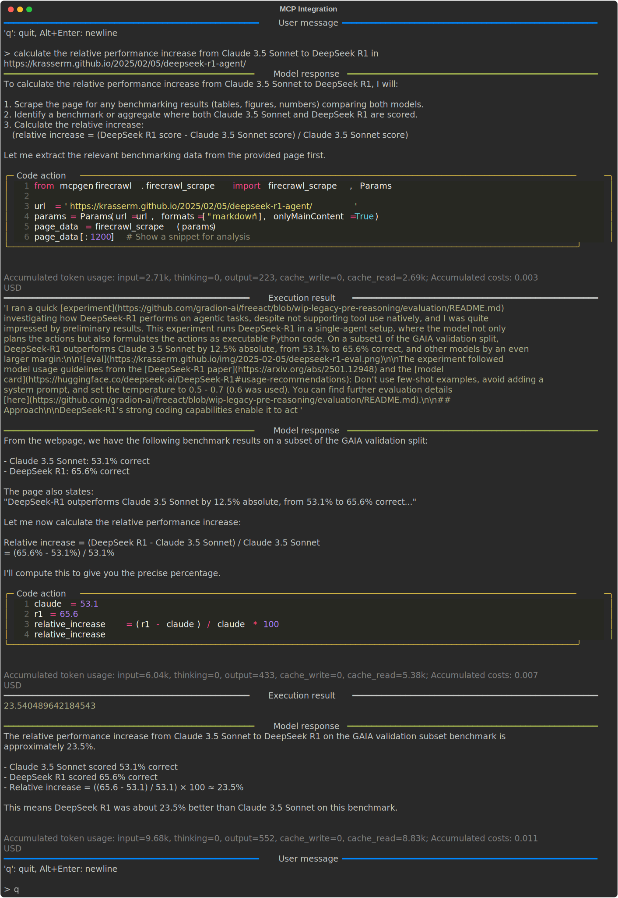

To leverage the vast ecosystem of [MCP](https://modelcontextprotocol.io/) servers and their tools, `freeact` generates Python client functions from MCP tool metadata and provides them as *skills* to `freeact` agents.
When `freeact` agents use these skills in their code actions, they invoke the corresponding MCP server tools.
`stdio` based MCP servers are executed within the [sandboxed environment](environment.md) while `sse` based MCP servers are expected to run elsewhere.

MCP servers are first registered at the [execution environment](environment.md) with [`register_mcp_servers`][freeact.environment.CodeProvider.register_mcp_servers].
Registration loads the MCP tool metadata from the MCP server and generates Python client functions from it.
The sources of these functions (or a subset thereof) can then be loaded with [`get_sources`][freeact.environment.CodeProvider.get_sources] and provided as skill sources to code action models.
This is demonstrated in the following example:

=== "Python"

    ```python
    --8<-- "examples/mcp.py"
    ```

    1. Registration generates MCP skill sources and returns the tool names of registered servers e.g.

        ```json
        {
            "firecrawl": [
                "firecrawl_scrape",
                "firecrawl_map",
                "firecrawl_crawl",
                "firecrawl_check_crawl_status",
                "firecrawl_search",
                "firecrawl_extract",
                "firecrawl_deep_research",
                "firecrawl_generate_llmstxt"
            ]
        }
        ```

    2. Here, we load only a subset of MCP skill sources. For loading all skill sources, use `mcp_tool_names=tool_names` or `mcp_tool_names={"firecrawl": None}`.

=== "CLI"

    Add MCP server data to an `mcp.json` file under key `mcpServers`. An optional `mcpTools` key supports the selection of a subset of MCP tools.
    
    ```json title="mcp.json"
    --8<-- "examples/mcp.json"
    ```

    Then start the agent from the command line with:

    ```bash
    --8<-- "examples/commands.txt:cli-mcp-integration"
    ```

!!! Example "Generated skill sources"

    - [`firecrawl_scrape`](https://github.com/gradion-ai/freeact/tree/main/docs/workspace/skills/private/default/mcpgen/firecrawl/firecrawl_scrape.py)
    - [`firecrawl_extract`](https://github.com/gradion-ai/freeact/tree/main/docs/workspace/skills/private/default/mcpgen/firecrawl/firecrawl_extract.py)

!!! Example

    [](output/mcp/conversation.html){target="_blank"}
