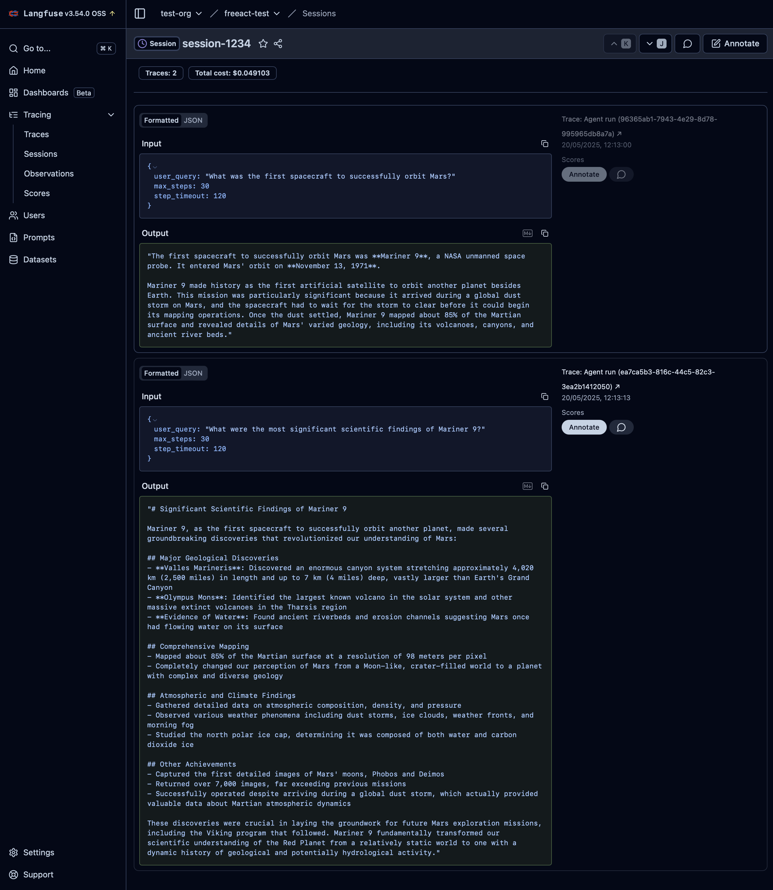
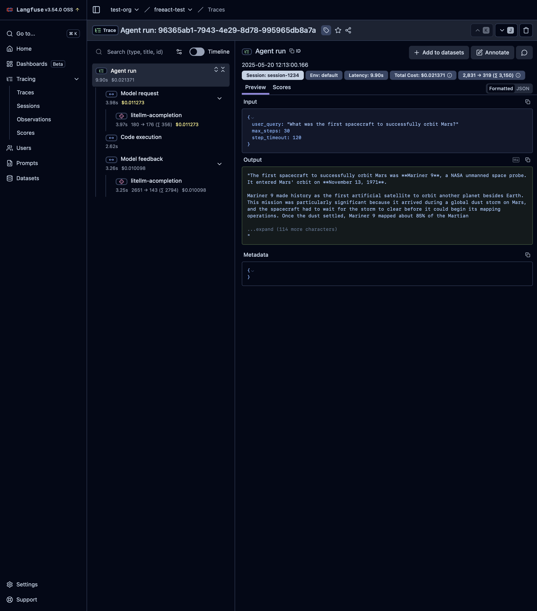
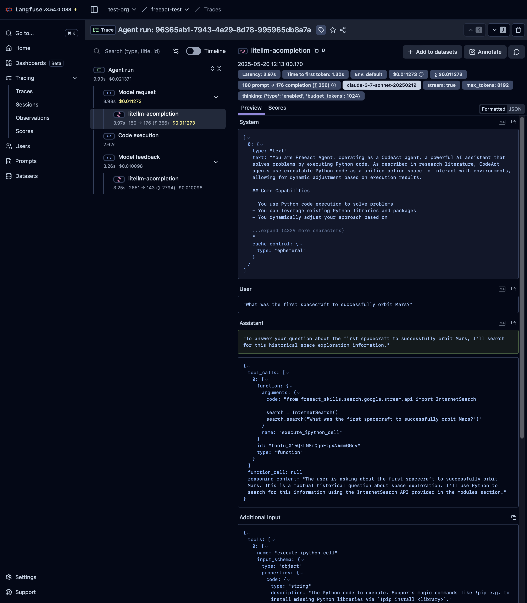

# Observability

`freeact` provides observability by tracing agent activities, code executions and model calls, including token usage and accumulated costs. 
We currently support [Langfuse](https://langfuse.com) as the observability backend for storing and visualizing trace data.

## Setup

To use tracing in `freeact`, either setup a [self-hosted Langfuse instance](https://langfuse.com/self-hosting/docker-compose) or create a [Langfuse Cloud](https://cloud.langfuse.com/auth/sign-in) account. 
Generate API credentials (secret and public keys) from your Langfuse project settings and place the keys together with the Langfuse host information in a `.env` file:

```env title=".env"
LANGFUSE_PUBLIC_KEY=pk-lf-...
LANGFUSE_SECRET_KEY=sk-lf-...
LANGFUSE_HOST=http://localhost:3000
```

## Agent tracing

=== "Python"

    Agent tracing in `freeact` is enabled by calling `tracing.configure()` at application startup. Once configured, all agent activities are automatically exported to Langfuse.

    By default, agent activities of a multi-turn conversation are grouped into a session. For custom session boundaries or a custom `session_id` use the `tracing.session()` context manager.
    
    ```python
    --8<-- "examples/observability.py"
    ```

    1. `tracing.configure()` configures an application to export agent traces to Langfuse. Accepts all [Langfuse configuration options](https://python.reference.langfuse.com/langfuse/decorators#LangfuseDecorator.configure) via parameters or as environment variables.
    2. All agent activities within this context are grouped into the session `session-123`. Use `None` to generate a random session id.

=== "CLI"

    Agent tracing in the CLI is enabled by setting the `--tracing` parameter.

    ```bash
    --8<-- "examples/commands.txt:cli-observability"
    ```

!!! Info

    A shutdown hook in `freeact` automatically flushes pending traces on application exit. For manual shutdown control, call `tracing.shutdown()` explicitly.

!!! Example

    This example demonstrates tracing of a [multi-turn conversation](output/observability/conversation.html){target="_blank"} starting with the query `What was the first spacecraft to successfully orbit Mars?`

    The screenshots below show how the collected trace data is displayed in the Langfuse Web UI.

    <figure markdown="span">
    [](output/observability/langfuse_session.png){target="_blank"}
    <figcaption>Session View: Displays the session created for the conversation with all related agent interactions</figcaption>
    </figure>

    <figure markdown="span">
    [](output/observability/langfuse_trace_agent.png){target="_blank"}
    <figcaption>Trace View: Shows aggregated metrics, span hierarchy and execution timeline for a single agent interaction</figcaption>
    </figure>

    <figure markdown="span">
    [](output/observability/langfuse_trace_llm.png){target="_blank"}
    <figcaption>Trace Detail View: Shows model prompts and completions, token usage statistics and costs for a single LLM call</figcaption>
    </figure>
