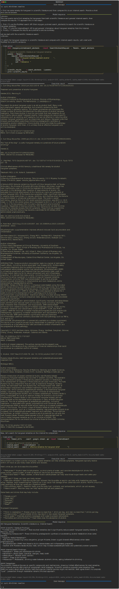

# Quickstart

The following example runs a conversational `freeact` agent through a terminal user interface, configured with `anthropic/claude-3-7-sonnet-20250219` as code action model and skills for [generative Google search with Gemini](https://ai.google.dev/gemini-api/docs/grounding?lang=python) and [PubMed literature search with an MCP server](https://github.com/grll/pubmedmcp). Both skills are executed in context of *code actions* in a [sandboxed environment](environment.md) based on IPython and Docker. Code actions are generated by the code action model.

The code action model learns about these skills via source code. It understands how to perform generative Google search with Gemini by inspecting the [sources](https://github.com/gradion-ai/freeact-skills/blob/main/freeact_skills/search/google/stream/api.py) of the `freeact_skills.search.google.stream.api` skill module, which is pre-installed on the [`ghcr.io/gradion-ai/ipybox:basic`](environment.md#prebuilt-docker-images) code execution container. The [source code](https://github.com/gradion-ai/freeact/tree/main/docs/workspace/skills/private/default/mcpgen/pubmed/search_abstracts.py) to invoke PubMed MCP tools is automatically generated by `freeact` during registration of the MCP server.

## Start agent

Place API keys for [Anthropic](https://console.anthropic.com/settings/keys) and [Gemini](https://aistudio.google.com/app/apikey) in a `.env` file:

```env title=".env"
ANTHROPIC_API_KEY=...
GEMINI_API_KEY=...
```

=== "Python"

    Install the `freeact` package:

    ```bash
    pip install freeact
    ```

    Then start the agent with this Python script:

    ```python
    --8<-- "examples/quickstart.py"
    ```

=== "CLI"

    Add the MCP server data to an `mcp.json` file:

    ```json title="mcp.json"
    --8<-- "examples/quickstart.json"
    ```

    Then start the agent with [`uvx`](https://docs.astral.sh/uv/) via the `freeact` CLI:

    ```bash
    --8<-- "examples/commands.txt:cli-quickstart"
    ```

!!! Info

    An initial start of the agent may take a few minutes as it downloads the Docker image of the code execution container. Subsequent runs have much lower startup latencies.

## Use agent

!!! Example

    [](output/quickstart/conversation.html){target="_blank"}
