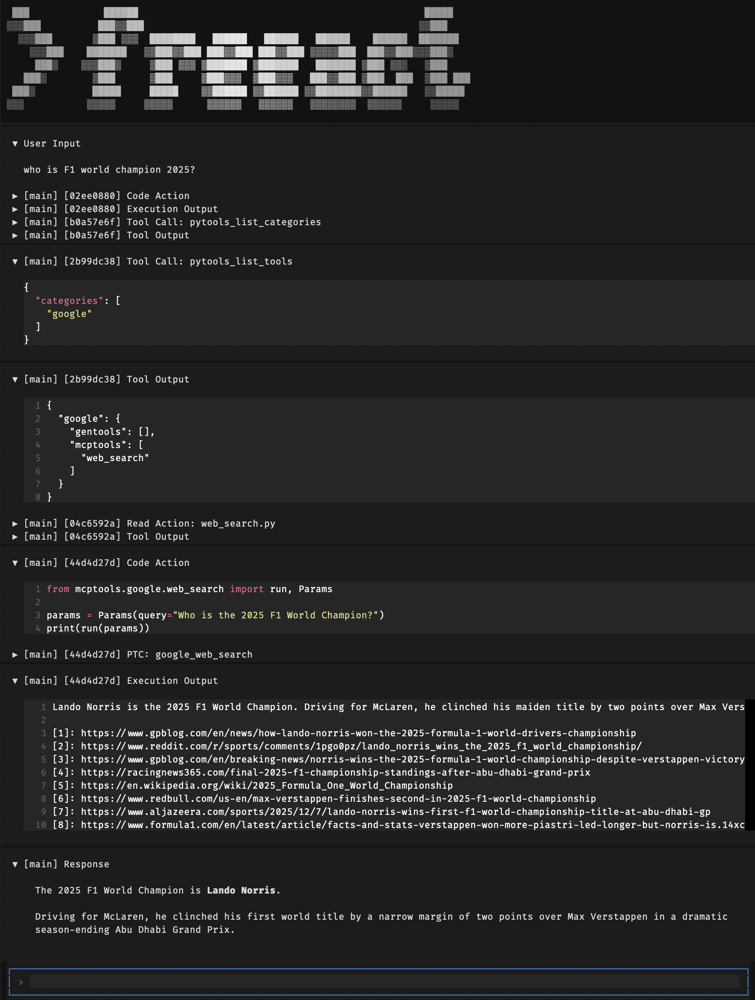
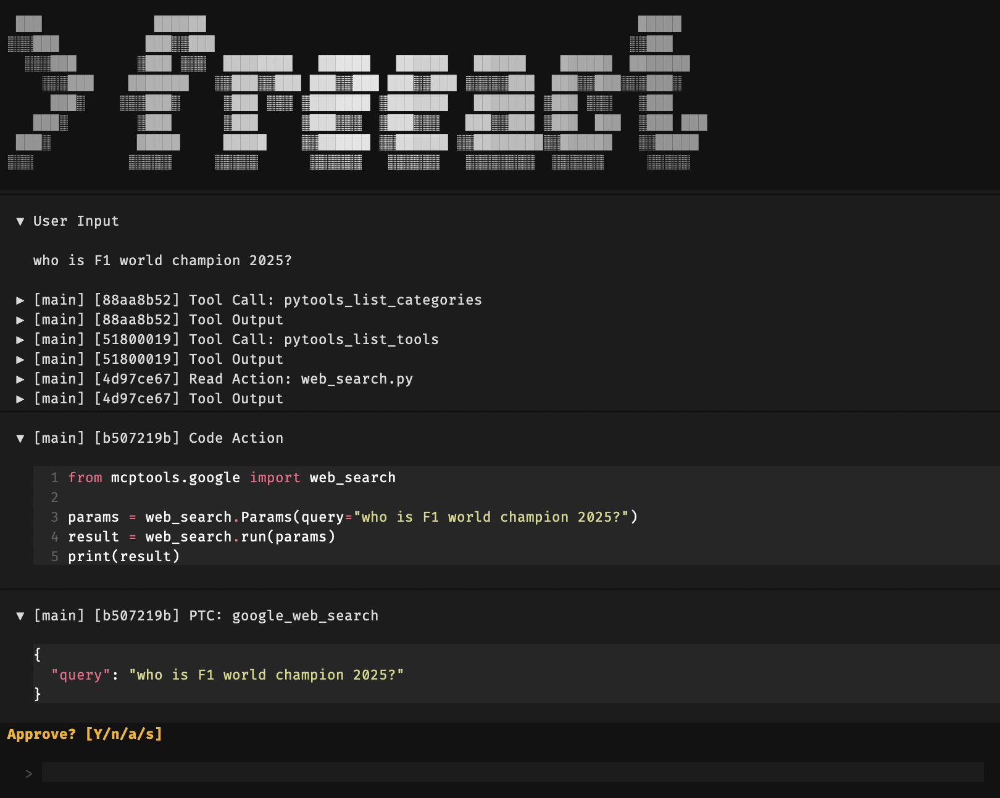

# Quickstart

This guide shows how to run a simple task using the freeact [CLI tool](#cli-tool) and the [Agent SDK](#agent-sdk).

## CLI Tool

Freeact provides a [CLI tool](cli.md) for running the agent in a terminal. 

### Starting Freeact

Create a workspace directory, set your API key, and start the agent:

```bash
mkdir my-workspace && cd my-workspace
echo "GEMINI_API_KEY=your-api-key" > .env
uvx freeact
```

See [Installation](installation.md) for alternative setup options and sandbox mode prerequisites.

!!! tip "Using a different model"

    Freeact supports any model compatible with Pydantic AI. To switch providers or configure model settings, see [Models](models.md).

### Generating MCP Tool APIs

On first start, the CLI tool auto-generates Python APIs for [configured](configuration.md#ptc_servers) MCP servers. For example, it creates `.freeact/generated/mcptools/google/web_search.py` for the `web_search` tool of the bundled `google` MCP server. With the generated Python API, the agent can import and call this tool programmatically.

!!! tip "Custom MCP servers"

    For calling the tools of your own MCP servers programmatically, add them to the [`ptc_servers`](configuration.md#ptc_servers) section in `.freeact/agent.json`. Freeact auto-generates a Python API for them when the CLI tool starts.

### Running a Task

With this setup and a question like 

> who is F1 world champion 2025? 

the CLI tool should produce an end result similar to the following screenshot:

[](screenshots/quickstart.png){ target="_blank" rel="noopener" }

The screenshot shows:

- **Progressive tool loading**: The agent progressively loads tool information: lists categories, lists tools in the `google` category, then reads the `web_search` API to understand its parameters.
- **Programmatic tool calling**: The agent writes Python code that imports the `web_search` tool from `mcptools.google` and calls it programmatically (PTC) with the user's query.

The code execution output shows the search result with source URLs. The agent response is a summary of it.

### Approval Prompt

Freeact can prompt for approval before running code actions and tool calls.
This also includes MCP tools called programmatically through generated Python APIs.

The screenshot below shows the approval prompt for a programmatic tool call (PTC):

[](screenshots/quickstart-approve.png){ target="_blank" rel="noopener" }

Code actions and tool calls can also be pre-approved. See [Approval Prompt](cli.md#approval-prompt) for prompt options and behavior.

## Agent SDK

The CLI tool is built on the [Agent SDK](sdk.md) that you can use directly in your applications. The following minimal example shows how to run the same task programmatically, with code actions and tool calls auto-approved:

```python
--8<-- "examples/basic_agent.py"
```
