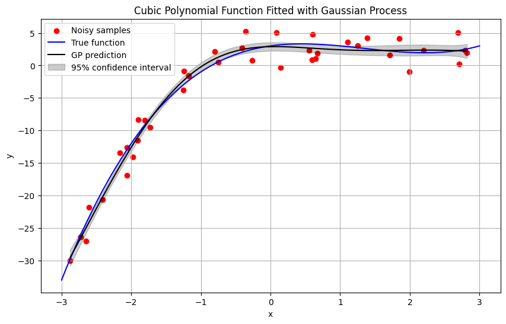

# Collaborative skill learning

Collaborative skill learning starts by requesting an agent to perform a task and then having a conversation with the agent to iteratively improve on that task.
This is mainly achieved by improving the code actions the agent generates.
In this phase the agent gets feedback from both the execution environment and the user.
When the user is satisfied with the agent's performance, it stores optimized code actions as skills in long-term memory[^1].
Since this is very similar to using a SWE agent, this phase is also called [skill development](#skill-development).
Stored skill modules can then be [reused](#skill-reuse) by other agents. 
These agents may also continue the skill development process, if needed.

## Skill development

In the following example, an agent is asked to fit a [Gaussian Process](https://scikit-learn.org/stable/modules/gaussian_process.html) (GP) to noisy samples drawn from a sine function.
The user then asks the agent to store the generated code actions as functions `gp_fit` (to fit a GP to data) and `plot_pred` (to plot GP predictions) in a module named `gp_fit.py`.
After reviewing the [code](https://github.com/gradion-ai/freeact/tree/main/docs/workspace/skills/private/default/gp_fit.py) of the stored skill module[^2], the user requests to change the default value of the `n_restarts` parameter to `15` and the agent edits the stored module.
Finally, the module is tested with noisy samples from a cosine function.

[^1]: By default, Anthropic and OpenAI models are configured with a file editor tool for storing and editing skills. To configure this for other models, set `use_editor_tool=True` in the constructor of [`LiteCodeActModel`][freeact.model.LiteCodeActModel].
[^2]: The stored skill module is accessible on the code execution container's host under [`private_skills_host_path`][freeact.environment.Workspace.private_skills_host_path], a directory mounted into the container. The path value can be obtained with:

    ```python
    async with execution_environment(ipybox_tag="ghcr.io/gradion-ai/ipybox:example") as env:
        skills_path = env.container.workspace.private_skills_host_path
        ...
    ```

=== "Python"

    ```python
    --8<-- "examples/skills/internal_knowledge.py"
    ```

=== "CLI"

    ```bash
    --8<-- "examples/commands.txt:cli-skills-internal-knowledge"
    ```

!!! Example

    [](../output/gp_1/conversation.html){target="_blank"}

    Produced images:

    [{ width="50%" }](../workspace/images/default/cfe9c96a.png){target="_blank"}
    [{ width="50%" }](../workspace/images/default/08a31ccc.png){target="_blank"}
    [{ width="50%" }](../workspace/images/default/37780eb3.png){target="_blank"}
    [{ width="50%" }](../workspace/images/default/17902906.png){target="_blank"}

## Skill reuse

The next example loads the sources of the [developed skill](#skill-development) and tests it with another agent.
The agent is asked to generate noisy samples from a non-linear function of its choice, fit them with a GP and plot the predictions.
The agent now uses the developed skill immediately in its code actions.

!!! Info

    At the moment, it is an application's responsibility to load skill sources. We will soon enhance `freeact` agents to [retrieve skill sources autonomously](autonomous-learning.md) depending on the user query and current state.


=== "Python"

    ```python
    --8<-- "examples/skills/collaborative_learning.py"
    ```

    1. Loads the sources of the [developed skill](#skill-development) module.

=== "CLI"

    ```bash
    --8<-- "examples/commands.txt:cli-skills-collaborative-learning"
    ```

!!! Example

    [](../output/gp_2/conversation.html){target="_blank"}

    Produced images:
    
    [{ width="50%" }](../workspace/images/default/9721d34c.png){target="_blank"}
    [{ width="50%" }](../workspace/images/default/a585cb5a.png){target="_blank"}
