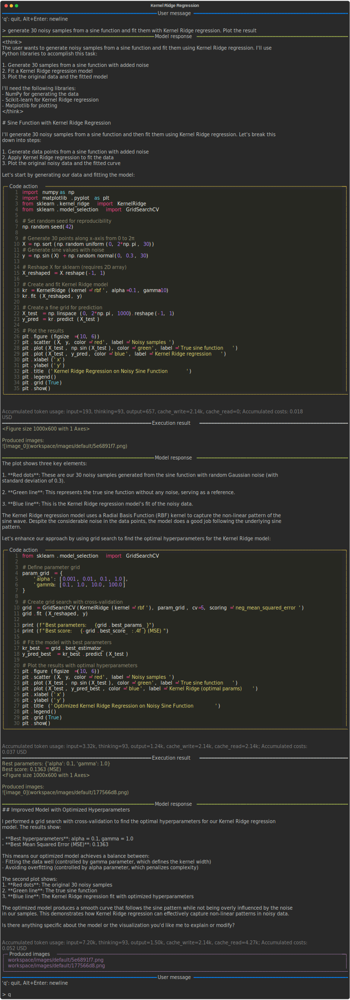
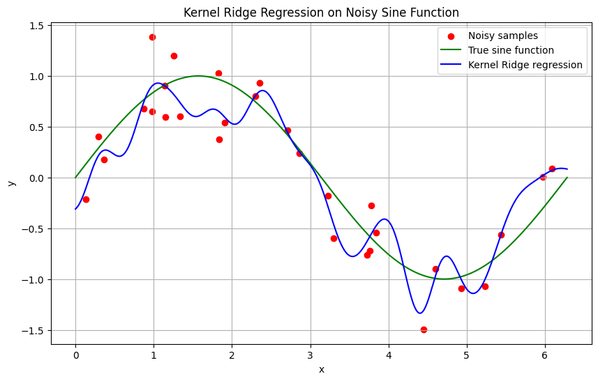
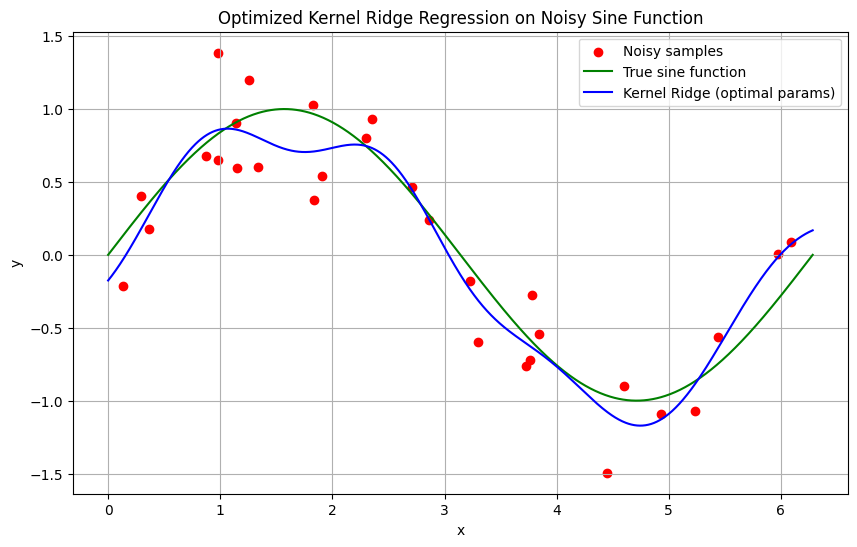

# Using internal knowledge

Modern LLMs have a vast amount of knowledge and skills acquired during pre- and post-training. 
For many tasks there's no need to provide them extra skill sources when used as code action models.
For example, Claude 3.7 Sonnet can perform a [Kernel Ridge Regression](https://scikit-learn.org/stable/modules/kernel_ridge.html), hyperparameter optimization and plotting the results out-of-the box from its prior knowledge:

=== "Python"

    ```python
    --8<-- "examples/skills/internal_knowledge.py"
    ```

=== "CLI"

    ```bash
    --8<-- "examples/commands.txt:cli-skills-internal-knowledge"
    ```

!!! Example

    [](../output/krr/conversation.html){target="_blank"}

    Produced images:

    [{ width="50%" }](../workspace/images/default/5e6891f7.png){target="_blank"}
    [{ width="50%" }](../workspace/images/default/177566d8.png){target="_blank"}
