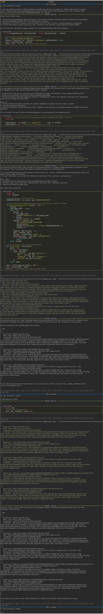

# Learning skills by example

A `freeact` agent can also learn skills from code examples in documentation or other sources instead of skill modules directly. These sources are usually retrieved by the agent itself using spezialized skills, like a [Firecrawl MCP server](https://github.com/mendableai/firecrawl-mcp-server) as in the following example, but can also be provided by a user or an application directly in context. In the following example, Python code is scraped from the [API documentation](https://readwise.io/reader_api) of [Readwise Reader](https://readwise.io/read) and used generate a code action for downloading documents from the user's Reader account.

=== "Python"

    ```python
    --8<-- "examples/skills/learning_by_example.py"
    ```

=== "CLI"

    ```env title=".env"
    READWISE_API_KEY=...
    ```

    ```json title="mcp.json"
    --8<-- "examples/skills/learning_by_example.json"
    ```

    ```bash
    --8<-- "examples/commands.txt:cli-skills-learning-by-example"
    ```

!!! Example

    [](../output/example/conversation.html){target="_blank"}
