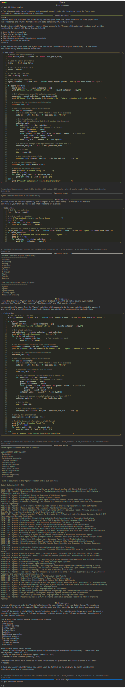

Other tasks may require providing an agent with predefined skills for being able to solve them more efficiently or to solve them at all. 
For example, the [`freeact_skills.zotero.api`](https://github.com/gradion-ai/freeact-skills/blob/main/freeact_skills/zotero/api.py) skill module from the [`freeact-skills`](https://gradion-ai.github.io/freeact-skills/) project provides a Python API for syncing [Zotero Group](https://www.zotero.org/groups/) libraries with a local directory, loading collection and document metadata as graph into memory and navigating it.

The entire [`freeact_skills.zotero`](https://github.com/gradion-ai/freeact-skills/blob/main/freeact_skills/zotero) package is partitioned into a `freeact_skills.zotero.api` module that provides the Python API, including a definition of domain classes. 
This module is presented to code action models so they can understand how to use the Zotero skill.
The `freeact_skills.zotero.impl` module contains further implementation details that need not be presented to code action models.

The following example demonstrates how a `freeact` agent uses that skill. It demonstrates how multiple methods and functions from the skill module can be flexibly combined within code actions. 
The [`freeact_skills.zotero.api`](https://github.com/gradion-ai/freeact-skills/blob/main/freeact_skills/zotero/api.py) module is also a good example how domain objects may encapsulate both data and behavior - a core principle of object-oriented programming. 
A `Collection` object, for example, encapsulates data and provides methods `sub_documents()` and `sub_collections()` to recursively traverse the collection and document graph under it. 

=== "Python"

    ```python
    --8<-- "examples/skills/predefined_skills.py"
    ```

=== "CLI"

    ```env title=".env"
    ZOTERO_API_KEY=...
    ZOTERO_GROUP_ID=...
    ```

    ```bash
    --8<-- "examples/commands.txt:cli-skills-predefined-skills"
    ```

!!! Example

    [](../output/zotero/conversation.html){target="_blank"}
