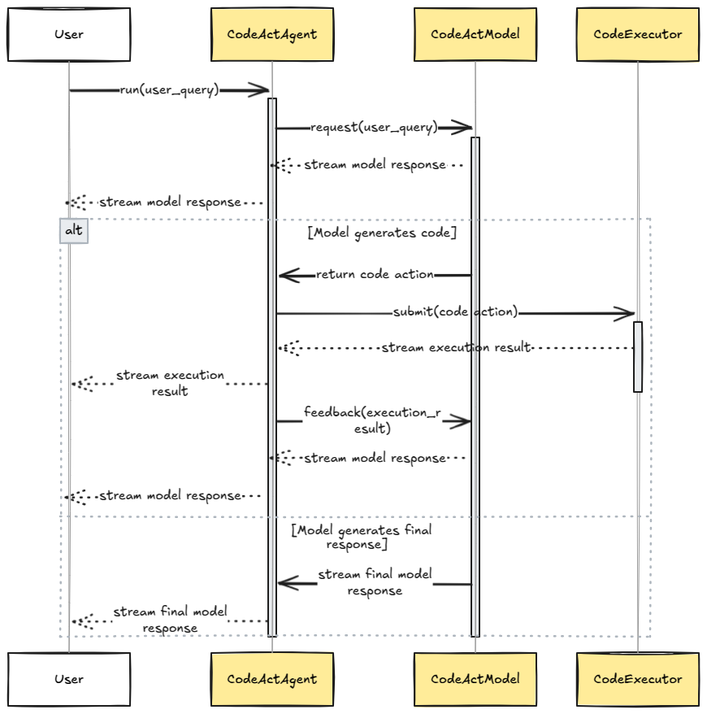

# Streaming protocol

`freeact` implements an end-to-end streaming protocol for user-agent communication. The diagram below illustrates a simplified version of this protocol. For details, refer to:

- [`CodeActAgent`][freeact.agent.CodeActAgent] and [`CodeActAgentTurn`][freeact.agent.CodeActAgentTurn]
- [`CodeActModel`][freeact.model.CodeActModel] and [`CodeActModelTurn`][freeact.model.CodeActModelTurn]
- [`CodeExecutor`][freeact.executor.CodeExecutor] and [`CodeExecution`][freeact.agent.CodeExecution]

<figure markdown>
  [{ style="display: block; margin: 0 auto" }](img/protocol.png){target="_blank"}
  <figcaption>Streaming protocol for user-agent communication (simplified)</figcaption>
</figure>
