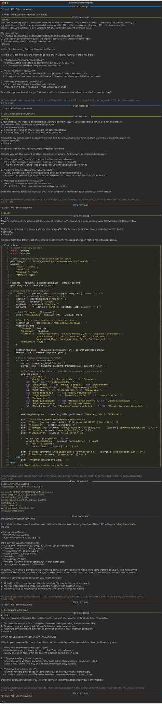

# System prompt

## Default templates

`freeact` uses default system prompt templates for instructing models to generate code actions:

- [`CODE_TAG_SYSTEM_TEMPLATE`](https://github.com/gradion-ai/freeact/blob/main/freeact/model/prompt/system_tag.py) instructs a model to include code actions directly in the response text, enclosed in `<code-action>` tags.
- [`TOOL_USE_SYSTEM_TEMPLATE`](https://github.com/gradion-ai/freeact/blob/main/freeact/model/prompt/system_tool.py) instructs a model to use an `execute_ipython_cell` tool and pass code actions as `code` argument.

These are chosen by `freeact` based on the `use_executor_tool` argument of the [`LiteCodeActModel`][freeact.model.litellm.LiteCodeActModel] constructor, or the model name and provider if `use_executor_tool=None`.

!!! Tip

    Default templates cover only generic agent behavior. To adapt an agent to application- and domain-specific requirements, it can be useful to provide [custom system templates](#custom-templates).

## Custom templates

The following example uses a [custom system template](https://github.com/gradion-ai/freeact/blob/main/examples/custom_template.py) that extends the default system template ([diff](system-prompt-diff.html)) with instructions for the agent to:

- create and share a plan before acting
- asking the user for feedback on the plan
- adjust the plan if necessary
- suggest 3 follow-up queries after the final response

=== "Python"

    ```python title="examples/custom.py"
    --8<-- "examples/custom.py"
    ```

    1. Configures the code action model with the custom system template.

    2. This is the default for `anthropic/claude-3-7-sonnet-20250219` but added here for clarity.

=== "CLI"

    ```bash
    curl -o custom_template.txt https://raw.githubusercontent.com/gradion-ai/freeact/refs/heads/main/examples/template.txt
    ```

    ```bash
    --8<-- "examples/commands.txt:cli-custom-template"
    ```

!!! Example

    [](output/custom/conversation.html){target="_blank"}
