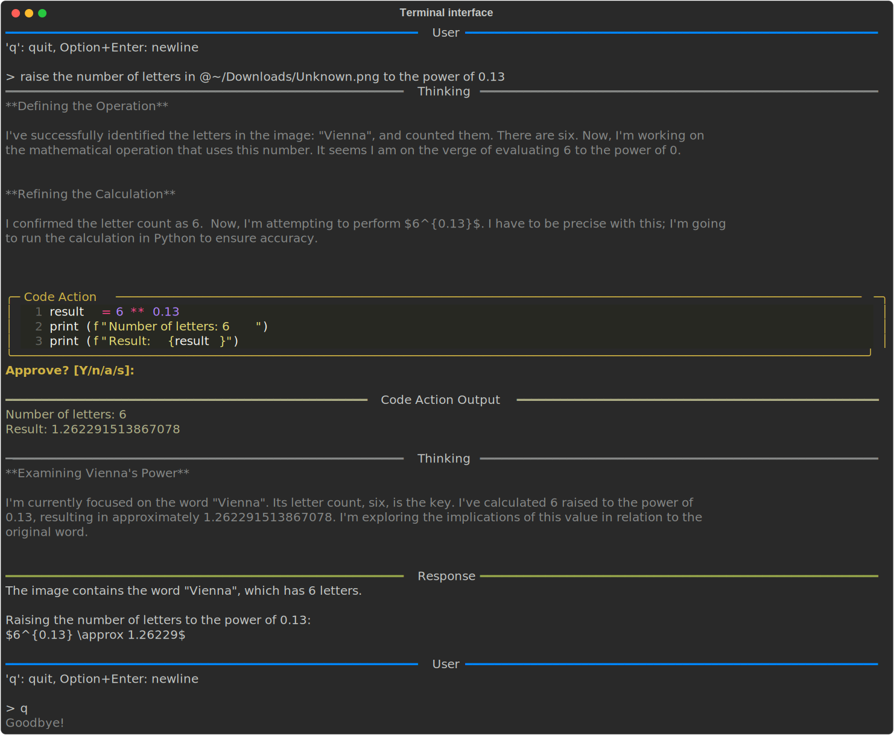

# Terminal Interface

The terminal interface provides interactive conversation with the agent in a terminal window. It is started with [`freeact`](cli.md) command.

[](recordings/terminal/conversation.html){target="_blank"}

## User Input

| Key | Action |
|-----|--------|
| `Enter` | Send message |
| `Option+Enter` (macOS) / `Alt+Enter` (Linux/Windows) | Insert newline |
| `q` + `Enter` | Quit |

## Image Attachments

Reference images using `@path` syntax:

```
@screenshot.png What does this show?
@images/ Describe these images
```

- Single file: `@path/to/image.png`
- Directory: `@path/to/dir/` (includes all images in directory, non-recursive)
- Supported formats: PNG, JPG, JPEG, GIF, WEBP
- Tab completion available for paths

Images are automatically downscaled if larger than 1024 pixels in either dimension.

## Approval Prompt

Before executing tool calls or code actions, the agent requests approval:

```
Approve? [Y/n/a/s]:
```

| Response | Effect |
|----------|--------|
| `Y` or `Enter` | Approve this execution |
| `n` | Reject this execution (ends the current agent turn) |
| `a` | Always approve this action (persisted to `.freeact/permissions.json`) |
| `s` | Approve for current session only |

See [Permissions](configuration.md#permissions) for details.
