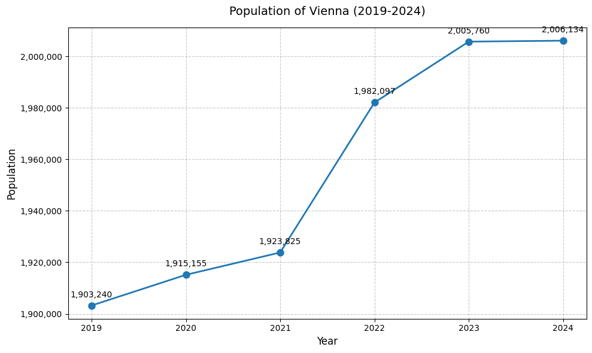

# Basic usage

A `freeact` agent system consists of:

- A code execution Docker container, managed by the [`CodeExecutionContainer`][freeact.executor.CodeExecutionContainer] context manager. This tutorial uses the `gradion-ai/ipybox-example` image.
- A code executor, managed by the [`CodeExecutor`][freeact.executor.CodeExecutor] context manager. It manages an IPython kernel's lifecycle within the container and handles code execution.
- A code action model that generates *code actions* to be executed by the executor. Models must implement the interfaces defined in the [`freeact.model`](../api/model.md) package. This tutorial uses [`Claude`][freeact.model.claude.model.Claude], configured with `claude-3-5-sonnet-20241022` as model name.
- A [`CodeActAgent`][freeact.agent.CodeActAgent] configured with both the model and executor. It orchestrates their interaction until a final response is ready.

```python title="freeact/examples/basics.py"
--8<-- "freeact/examples/basics.py"
```

1.  
```python title="freeact/cli/utils.py::stream_conversation"
--8<-- "freeact/cli/utils.py:stream_conversation"
--8<-- "freeact/cli/utils.py:stream_turn"
```

2. Tag of the `ipybox` Docker image.

3. Path to the workspace directory on the host machine. This directory enables sharing custom skills modules between the container and host machine (see [Custom skills](skills.md) tutorial).

4. Key for this executor's private workspace directories:
    - `workspace/skills/private/example`: Private skills and working directory
    - `workspace/images/example`: Directory for storing produced images

5. Container host port. Automatically allocated by [`CodeExecutionContainer`][freeact.executor.CodeExecutionContainer] but can be manually specified.

6. Skill modules on the `executor`'s Python path that can be resolved to their source code and metadata. This information is included in the code action `model`'s context.

7. A contextual [`Logger`][freeact.logger.Logger] for recording messages and metadata.

A `CodeActAgent` can engage in multi-turn conversations with a user. Each turn is initiated using the agent's [`run`][freeact.agent.CodeActAgent.run] method. We use the `stream_conversation` (1) helper function to `run` the agent and stream the output from both the agent's model and code executor to `stdout`.
{ .annotate }

1.  
```python title="freeact/cli/utils.py::stream_conversation"
--8<-- "freeact/cli/utils.py:stream_conversation"
--8<-- "freeact/cli/utils.py:stream_turn"
```

This tutorial uses the `freeact_skills.search.google.stream.api` skill module from the [`freeact-skills`](https://gradion-ai.github.io/freeact-skills/) project to process queries that require internet searches. This module provides generative Google search capabilities powered by the Gemini 2 API.

The skill module's source code is obtained from the `executor` and passed to the model through the agent's `run` method. Other model implementations may require skill module sources to be passed through their constructor instead.

## Running

```shell
python -m freeact.examples.basics
```

initiates an interactive conversation with the agent. The output below shows the conversation flow, where user messages and final agent responses are displayed in blockquotes. Intermediate model outputs and execution details can be viewed by expanding the `...` sections. 

!!! Note
    
    Alternatively, you can use the `freeact` CLI, which produces equivalent output to the Python example:

    ```shell
    --8<-- "freeact/examples/commands.txt:cli-basics-claude"
    ```

    To use `gemini-2.0-flash-exp` instead of `claude-3-5-sonnet-20241022`, run:

    ```shell
    --8<-- "freeact/examples/commands.txt:cli-basics-gemini"
    ```

> `User message: ('q' to quit)` raise the current population of vienna to the power of 0.13

`...` (1)
{ .annotate }

1.  `Agent response:`

    &lt;thinking&gt;  
    To solve this problem, I need to:

    1. Search for the current population of Vienna using the InternetSearch API
    2. Parse the result to extract the population number
    3. Raise that number to the power of 0.13

    I'll write code that uses the InternetSearch class to get this information and perform the calculation.  
    &lt;/thinking&gt;

    ```python
    from freeact_skills.search.google.stream.api import InternetSearch

    # Create search instance and search for Vienna's population
    search = InternetSearch()
    print("Searching for Vienna's population...")
    search.search("What is the current population of Vienna, Austria in 2024? Just the number")
    ```

    `Execution result:`

    Searching for Vienna's population...  
    The population of Vienna, Austria is approximately **2,006,134** as of the beginning of 2024.

    `Agent response:`

    Now I'll extract this number and perform the calculation.

    ```python
    # Extract the population number and perform the calculation
    population = 2006134
    result = population ** 0.13

    print(f"Vienna's population ({population}) raised to the power of 0.13 = {result:.2f}")
    ```

> `Agent response:`
>
> The result of raising Vienna's current population (2,006,134) to the power of 0.13 is 6.60.
<!-- -->
> `User message: ('q' to quit)` plot its evolution over the past 5 years without raising to 0.13

`...` (1)
{ .annotate }

1.  `Agent response:`

    &lt;thinking&gt;  
    To create this plot, I need to:

    1. Search for Vienna's population data over the past 5 years
    2. Create a line plot using matplotlib showing the evolution
    3. Make sure to properly label the axes and show the plot

    &lt;/thinking&gt;

    ```python
    from freeact_skills.search.google.stream.api import InternetSearch

    # Search for historical population data
    search = InternetSearch()
    print("Searching for Vienna's population over the past 5 years...")
    search.search("What was Vienna's population each year from 2019 to 2024? List year by year")
    ```

    `Execution result:`

    Searching for Vienna's population over the past 5 years...  
    It appears you're asking about the population of Vienna, Austria, from 2019 to 2024. Here's a breakdown of the available data:

    **Please note:** Population figures can vary slightly depending on the source and the specific date within the year the data was collected. The figures below are based on the most recent and reliable data available.

    *   **2019:** Approximately 1,903,240
    *   **2020:** Approximately 1,915,155
    *   **2021:** Approximately 1,923,825. By the end of October 2021, the population was over 1.92 million.
    *   **2022:** Approximately 1,982,097. The population of Vienna increased by 12.4% between 2011 and October 31, 2021.
    *   **2023:** Approximately 2,005,760. Vienna passed the 2 million mark in the third quarter of 2023.
    *   **2024:** Approximately 2,006,134 (as of January 1, 2024).

    **Key Trends and Additional Information:**

    *   **Growth:** Vienna has experienced significant population growth in recent years.
    *   **2 Million Mark:** Vienna's population surpassed 2 million in 2023.
    *   **Fastest Growing City:** Vienna is considered one of the fastest-growing cities in Europe.
    *   **Migration:** A significant portion of Austria's population growth is due to net migration gains.
    *   **Most Livable City:** Vienna has consistently been ranked as one of the most livable cities in the world.
    *   **Largest City in Austria:** Vienna is the largest city in Austria.
    *   **Foreign Nationals:** As of January 1, 2024, 35.4% of Vienna's population were foreign nationals.
    *   **Population Density:** Vienna has an average population density of 4,835 people per square kilometer.

    It's worth noting that some sources provide slightly different numbers, but the figures above represent the most consistent and up-to-date information available.

    `Agent response:`

    Now I'll create a plot using this data:

    ```python
    import matplotlib.pyplot as plt
    import numpy as np

    # Data from the search results
    years = [2019, 2020, 2021, 2022, 2023, 2024]
    population = [1903240, 1915155, 1923825, 1982097, 2005760, 2006134]

    # Create the plot
    plt.figure(figsize=(10, 6))
    plt.plot(years, population, marker='o', linewidth=2, markersize=8)

    # Customize the plot
    plt.title("Population of Vienna (2019-2024)", fontsize=14, pad=15)
    plt.xlabel("Year", fontsize=12)
    plt.ylabel("Population", fontsize=12)

    # Format y-axis to show millions
    plt.gca().yaxis.set_major_formatter(plt.FuncFormatter(lambda x, p: f'{x:,.0f}'))

    # Add grid for better readability
    plt.grid(True, linestyle='--', alpha=0.7)

    # Rotate x-axis labels for better readability
    plt.xticks(years, rotation=0)

    # Add data points labels
    for i, pop in enumerate(population):
        plt.annotate(f'{pop:,}',
                    (years[i], pop),
                    textcoords="offset points",
                    xytext=(0,10),
                    ha='center')

    # Adjust layout to prevent label cutoff
    plt.tight_layout()

    # Show the plot
    plt.show()
    ```
    `Execution result:`

    &lt;Figure size 1000x600 with 1 Axes&gt;

    `Produced images:`

    \!\[image_0\](workspace/images/example/a53d6656.png)


> `Agent response:`

> I've created a line plot showing Vienna's population evolution from 2019 to 2024. The plot shows a steady increase in population over these years, with a particularly notable jump between 2021 and 2022. The city reached and surpassed the 2 million mark in 2023, and as of 2024, the population stands at 2,006,134 people. Each data point is labeled with the exact population figure for easy reference.

> `Produced images:`

> [{ width="50%" }](../workspace/images/example/a53d6656.png){target="_blank"}
