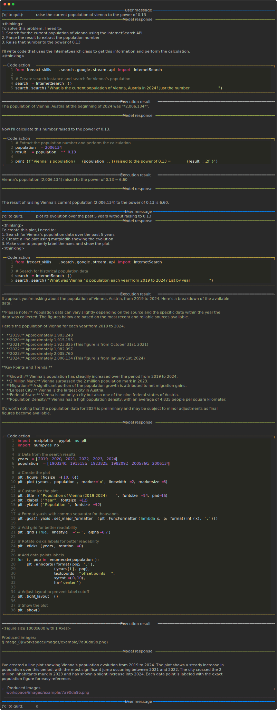

# Basic usage

A `freeact` agent system consists of:

- A code execution Docker container, managed by the [`CodeExecutionContainer`][freeact.executor.CodeExecutionContainer] context manager. This tutorial uses the `gradion-ai/ipybox-example` image.
- A code executor, managed by the [`CodeExecutor`][freeact.executor.CodeExecutor] context manager. It manages an IPython kernel's lifecycle within the container and handles code execution.
- A code action model that generates *code actions* to be executed by the executor. Models must implement the interfaces defined in the [`freeact.model`](../api/model.md) package. This tutorial uses [`Claude`][freeact.model.claude.model.Claude], configured with `claude-3-5-sonnet-20241022` as model name.
- A [`CodeActAgent`][freeact.agent.CodeActAgent] configured with both the model and executor. It orchestrates their interaction until a final response is ready.

```python title="freeact/examples/basics.py"
--8<-- "freeact/examples/basics.py"
```

1.  
```python title="freeact/examples/utils.py::stream_conversation"
--8<-- "freeact/examples/utils.py:stream_conversation"
--8<-- "freeact/examples/utils.py:stream_turn"
```

2. Tag of the `ipybox` Docker image.

3. Path to the workspace directory on the host machine. This directory enables sharing custom skills modules between the container and host machine (see [Skill development](skills.md) tutorial).

4. Key for this executor's private workspace directories:
    - `workspace/skills/private/example`: Private skills and working directory
    - `workspace/images/example`: Directory for storing produced images

5. Container host port. Automatically allocated by [`CodeExecutionContainer`][freeact.executor.CodeExecutionContainer] but can be manually specified.

6. Skill modules on the `executor`'s Python path that can be resolved to their source code and metadata. This information is included in the code action `model`'s context.

7. A contextual [`Logger`][freeact.logger.Logger] for recording messages and metadata.

A `CodeActAgent` can engage in multi-turn conversations with a user. Each turn is initiated using the agent's [`run`][freeact.agent.CodeActAgent.run] method. We use the `stream_conversation` (1) helper function to `run` the agent and stream the output from both the agent's model and code executor to `stdout`.
{ .annotate }

1.  
```python title="freeact/examples/utils.py::stream_conversation"
--8<-- "freeact/examples/utils.py:stream_conversation"
--8<-- "freeact/examples/utils.py:stream_turn"
```

This tutorial uses the `freeact_skills.search.google.stream.api` skill module from the [`freeact-skills`](https://gradion-ai.github.io/freeact-skills/) project to process queries that require internet searches. This module provides generative Google search capabilities powered by the Gemini 2 API.

The skill module's source code is obtained from the `executor` and passed to the model through the agent's `run` method. Other model implementations may require skill module sources to be passed through their constructor instead.

## Setup

Install `freeact` with:

```bash
pip install freeact
```

The tutorials require an `ANTHROPIC_API_KEY` for the Claude API and a `GOOGLE_API_KEY` for the Gemini 2 API. You can get them from [Anthropic](https://docs.anthropic.com/en/docs/api/api-keys) and [Google AI Studio](https://aistudio.google.com/app/apikey). Add them to a `.env` file in the current working directory:

```env title=".env"
ANTHROPIC_API_KEY=...
GOOGLE_API_KEY=...
```

The tutorials use the pre-built [`ghcr.io/gradion-ai/ipybox:example`](../installation.md#tutorial-docker-image) Docker image for sandboxed code execution.

## Running

The Python example above is part of the `freeact` package and can be run with:

```shell
python -m freeact.examples.basics
```

For formatted and colored console output, as shown in the [example conversation](#example-conversation), you can use the `freeact` CLI:

```shell
--8<-- "freeact/examples/commands.txt:cli-basics-claude"
```

To use Gemini instead of Claude, run:

```shell
--8<-- "freeact/examples/commands.txt:cli-basics-gemini"
```

### Example conversation

[](output/basics.html){target="_blank"}

Produced images:

[{ width="50%" }](../workspace/images/example/7a90da9b.png){target="_blank"}
