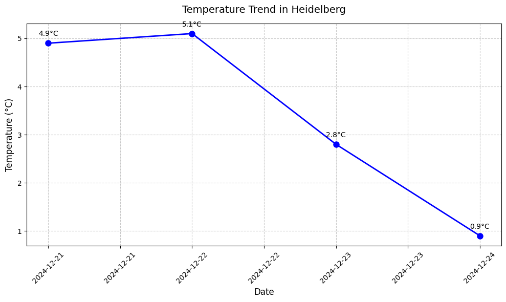

# System extensions

This tutorial demonstrates how `freeact` agents can be customized through system extensions. These may include runbooks, constraints, domain-specific rules, or whatever you think is relevant for the agent's behavior. You'll see:

- How to implement a human-in-the-loop workflow, enabling users to review and edit the agent's action plans
- How to make the agent more proactive by configuring it to suggest 3 follow-up actions after each response
- How to implement domain-specific rules (demonstrated by an example that multiplies temperatures by 3.17 in weather-related responses)

!!! Note
    System extensions are currently only supported for [Claude][freeact.model.claude.model.Claude] models.

The conversation below was guided by this system extension:

```text title="extension.txt"
--8<-- "freeact/examples/extension.txt"
```

It was initiated with the following `freeact.cli` command, referencing the `extension.txt` file with the `--system-extension` option and reusing the developed `weather.weather_report` skill from the [Custom skills](skills.md) tutorial.

```shell
--8<-- "freeact/examples/commands.txt:cli-extension"
```

> `User message: ('q' to quit)` what is the weather in heidelberg? do not plot
<!-- -->
> `Agent response:`
>
> Let me help you get the weather information for Heidelberg.
>
> &lt;thinking&gt;
>
> 1. Since this is a weather-related query for a specific city (Heidelberg), I need to:
>     - Use the weather_report module to get the current weather
>     - According to the domain-specific rules, I need to multiply the current temperature by 3.17
> 2. I'll use the get_weather_report function from the weather.weather_report module
> 3. I'll extract just the current temperature and perform the required calculation
>
> &lt;/thinking&gt;
>
> Would you like me to proceed with generating and executing the code based on this reasoning?
<!-- -->
> `User message: ('q' to quit)` history should be over past 3 days
<!-- -->
> `Agent response:`
>
> &lt;thinking&gt;
>
> 1. Since this is a weather-related query for Heidelberg, I need to:
>     - Use the weather_report module to get the current weather and 3 days of history
>     - According to the domain-specific rules, I need to multiply the current temperature by 3.17
> 2. I'll use the get_weather_report function from the weather.weather_report module with n_days=3
> 3. I'll extract:
>     - Current temperature (and multiply by 3.17)
>     - Historical temperatures for the past 3 days
> 4. I'll format this information in an easy to read way
>
> &lt;/thinking&gt;
>
> Would you like me to proceed with generating and executing the code based on this reasoning?
<!-- -->
> `User message: ('q' to quit)` y

`...` (1)
{ .annotate }

1.  `Agent response:`

    I'll generate and execute the code now.

    ```python
    from weather.weather_report import get_weather_report
    from datetime import datetime

    # Get weather report for Heidelberg with 3 days history
    weather_data = get_weather_report("Heidelberg", n_days=3)

    # Extract current data
    current_temp = weather_data['current']['temperature']
    current_time = weather_data['current']['measurement_time']
    special_temp = current_temp * 3.17

    # Extract historical data
    historical = weather_data['historical']
    dates = historical['dates']
    temps = historical['temperatures']

    # Print results
    print(f"Weather in Heidelberg:")
    print(f"\nCurrent temperature ({current_time.strftime('%Y-%m-%d %H:%M')}): {current_temp:.1f}°C")
    print(f"Current temperature × 3.17 = {special_temp:.1f}°C")

    print("\nHistorical temperatures (past 3 days):")
    for date, temp in zip(dates, temps):
        print(f"{date}: {temp:.1f}°C")
    ```

    `Execution result:`

    Weather in Heidelberg:

    Current temperature (2024-12-24 07:30): 0.9°C  
    Current temperature × 3.17 = 2.9°C

    Historical temperatures (past 3 days):  
    2024-12-21: 4.9°C  
    2024-12-22: 5.1°C  
    2024-12-23: 2.8°C

> `Agent response:`
>
> Based on the weather data:

> - The current temperature in Heidelberg is 0.9°C (measured at 2024-12-24 07:30)
> - According to the special calculation rule (temp × 3.17), the result is 2.9°C
> - Over the past 3 days, temperatures have been:
>     - Dec 21: 4.9°C
>     - Dec 22: 5.1°C
>     - Dec 23: 2.8°C
>
>     showing a cooling trend towards today's temperature.
>
> Here are 3 suggested follow-up actions:
>
> 1. Would you like to see a visualization of the temperature trend over these days?
> 2. Would you like to compare Heidelberg's weather with another nearby city?
> 3. Would you like to get additional weather parameters like humidity for Heidelberg?
>
> Please let me know which follow-up action interests you, or feel free to ask something else!
<!-- -->
> `User message: ('q' to quit)` 1
<!-- -->
> `Agent response:`
>
> &lt;thinking&gt;

> 1. To visualize the temperature trend, I will:
>     - Create a line plot using matplotlib
>     - Include both historical and current temperatures
>     - Add proper labels, title, and grid for better readability
>     - Format dates nicely on the x-axis
> 2. I'll combine the historical data with the current temperature to show the complete trend
> 3. I'll make sure to call plt.show() to display the plot
>
> &lt;/thinking&gt;
>
> Would you like me to proceed with generating and executing the code based on this reasoning?
<!-- -->
> `User message: ('q' to quit)` y

`...` (1)
{ .annotate }

1.  `Agent response:`

    I'll generate and execute the code to create the visualization now.

    ```python
    import matplotlib.pyplot as plt
    from datetime import datetime
    import matplotlib.dates as mdates

    # Get the data again
    weather_data = get_weather_report("Heidelberg", n_days=3)

    # Combine historical and current data
    dates = weather_data['historical']['dates'] + [weather_data['current']['measurement_time'].date()]
    temperatures = weather_data['historical']['temperatures'] + [weather_data['current']['temperature']]

    # Create the plot
    plt.figure(figsize=(10, 6))
    plt.plot(dates, temperatures, 'b-o', linewidth=2, markersize=8)

    # Customize the plot
    plt.title('Temperature Trend in Heidelberg', fontsize=14, pad=15)
    plt.xlabel('Date', fontsize=12)
    plt.ylabel('Temperature (°C)', fontsize=12)
    plt.grid(True, linestyle='--', alpha=0.7)

    # Format x-axis
    plt.gca().xaxis.set_major_formatter(mdates.DateFormatter('%Y-%m-%d'))
    plt.xticks(rotation=45)

    # Add value labels on points
    for i, (d, t) in enumerate(zip(dates, temperatures)):
        plt.annotate(f'{t:.1f}°C',
                    (d, t),
                    textcoords="offset points",
                    xytext=(0,10),
                    ha='center')

    plt.tight_layout()
    plt.show()
    ```

    `Execution result:`

    &lt;Figure size 1000x600 with 1 Axes&gt;

    `Produced images:`

    \!\[image_0\](workspace/images/example/98709542.png)

> `Agent response:`
>
> I've created a visualization of Heidelberg's temperature trend over the past few days. The graph shows:
>
> - A relatively stable temperature around 5°C on Dec 21-22
> - A significant drop to 2.8°C on Dec 23
> - A further decrease to the current temperature of 0.9°C on Dec 24
>
> Here are 3 suggested follow-up actions:
>
> 1. Would you like to see this same visualization but with the humidity data included?
> 2. Would you like to extend the historical period to see a longer trend (e.g., 7 days)?
> 3. Would you like to compare this temperature trend with another city?
>
> Please let me know which follow-up action interests you, or feel free to ask something else!
>
> `Produced images:`
>
> [{ width="50%" }](../workspace/images/example/98709542.png){target="_blank"}
<!-- -->
> `User message: ('q' to quit)` q

---

...
