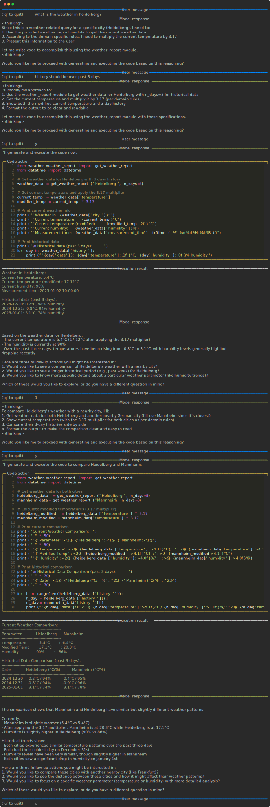

# System extensions

This tutorial demonstrates how `freeact` agents can be customized through system extensions. These may include runbooks, constraints, domain-specific rules, or whatever you think is relevant for the agent's behavior. You'll see:

- How to implement a human-in-the-loop workflow, enabling users to review and edit the agent's action plans
- How to make the agent more proactive by configuring it to suggest 3 follow-up actions after each response
- How to implement domain-specific rules (demonstrated by an example that multiplies temperatures by 3.17 in weather-related responses)

!!! Note
    System extensions are currently only supported for [Claude][freeact.model.claude.model.Claude] models and [DeepSeek V3][freeact.model.deepseek.model.DeepSeekV3].

The [example conversation](#example-conversation) below was guided by this system extension:

```text title="extension.txt"
--8<-- "freeact/examples/extension.txt"
```

It was initiated with the following `freeact.cli` command, referencing the `extension.txt` file with the `--system-extension` option and reusing the developed `weather.weather_report` skill from the [Skill development](skills.md) tutorial.

```shell
--8<-- "freeact/examples/commands.txt:cli-extension"
```

### Example conversation

[](output/extend.html){target="_blank"}
