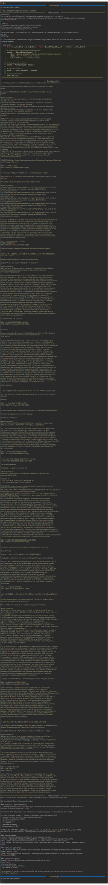

# MCP servers

A `freeact` agent system can use MCP server tools in code actions. The execution environment generates Python functions from MCP tool metadata and uses these functions in code actions. `stdio` based servers are running inside the code execution container, `sse` based servers are running elsewhere (not managed by `freeact`). 

## Python example

```python title="examples/mcp.py"
--8<-- "examples/mcp.py"
```

1. An MCP server for loading PubMed abstracts.

2. Register MCP servers at code provider. This generates Python functions for MCP tools.

3. Provide (selected) server names and tool names to load the sources of generated functions.

Registration of MCP servers needs to be done only once per `workspace_key`. During registration, a Python function is generated for each MCP server tool and stored in workspace's private skills directory. Repeated registration overwrites previous registrations.

In the example above, the `pubmed` MCP server provides a single `search_abstracts` tool. The returned `mcp_tool_names` dictionary is: 

```json
{"pubmed": ["search_abstracts"]}
```

The sources of generated functions are loaded with `provider.get_sources()` and used as `skill_sources` for an agent so that it can include them into its code actions. Generated MCP skills can be mixed with any other skills supported by `freeact`.

!!! Hint

    For `sse` based MCP servers, provide their URL e.g.

    ```python
    server_params = {
        "my_sse_based_mcp_server": {
            "url": "https://my-sse-based-mcp-server.com:8000/sse"
        }
    }
    ```

## CLI example

MCP servers can also be registered via the [command line interface](../cli.md). Given an `mcp.json` file

```json title="mcp.json"
--8<-- "examples/mcp.json"
```

a corresponding CLI command is:

```shell
--8<-- "examples/commands.txt:mcp-server"
```

## Example conversation

[](output/mcp.html){target="_blank"}
