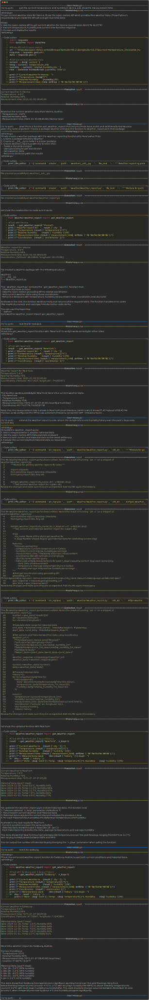
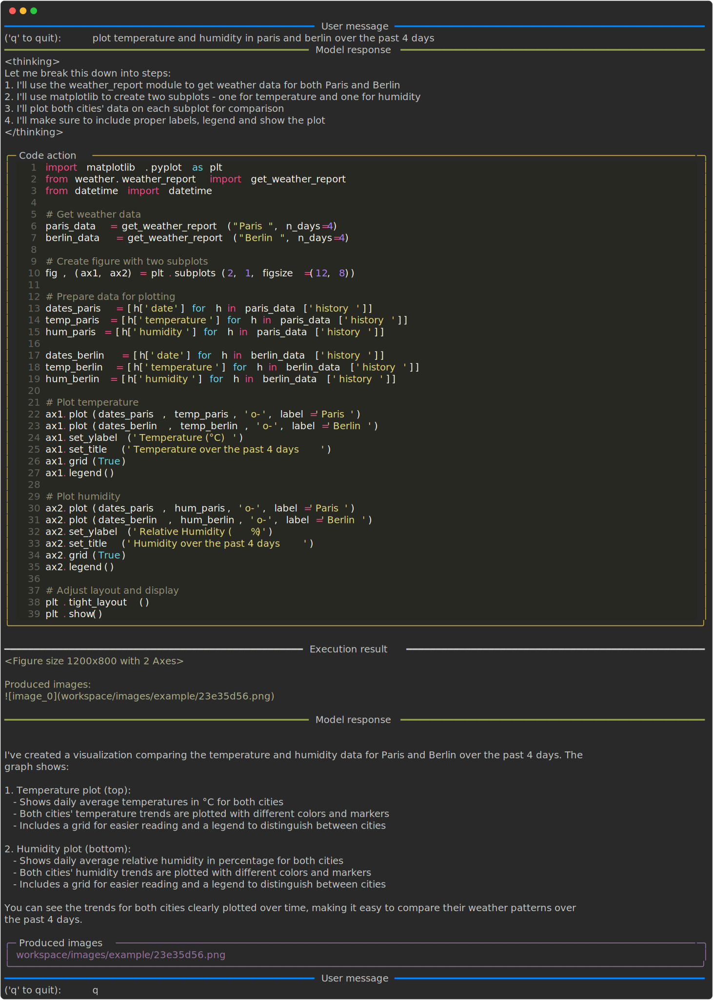

# Skill development

This tutorial demonstrates how to develop and use custom skills through two examples: first creating a weather reporting skill from scratch, and then using that skill to generate weather comparisons and visualizations.

!!! Tip "Prerequisites"
    It is recommended to complete the [Basic Usage](basics.md) tutorial before proceeding with this one, as it covers fundamental concepts that are built upon here.

## Interactive development

This section demonstrates the interactive development of a custom weather reporting skill through a conversation between a user and a `freeact` agent. You'll see how the agent assists with software engineering tasks, evolving a simple weather query into a Python package that can:

- Fetch current weather conditions for any city
- Resolve city names to geographical coordinates
- Retrieve historical weather data
- Return structured data for both current and historical weather

The development progresses through several iterations:

1. Creating a code action to fetch Vienna's weather
2. Converting it into a proper Python package
3. Adding city name coordinate resolution
4. Incorporating historical weather data
5. Testing with various cities (New York, Vienna, Salzburg)

The interactively developed `weather.weather_report` (1) skill uses the Open-Meteo API for weather data and geocoding.
{ .annotate }

1. 
```python
--8<-- "docs/workspace/skills/private/example/weather/weather_report.py"
```

!!! Note
    Interactive skill development is currently only supported for [Claude][freeact.model.claude.model.Claude] models.

The [example conversation](#example-conversation) below was initiated with the following `freeact.cli` command[^1]. The developed `weather.weather_report` skill is written to the `workspace/skills/private/example` directory.

[^1]: The provided skill modules are not needed in this example but included to demonstrate that their usage is optional.

```shell
--8<-- "freeact/examples/commands.txt:cli-skills"
```

### Example conversation

[](output/skills-dev.html){target="_blank"}

## Skill usage

This section demonstrates how to use the previously developed weather reporting skill in a separate conversation. After loading `weather.weather_report` as additional skill[^2], we'll see how the agent can:

- Create multi-city weather reports with much smaller code actions
- Create data visualizations comparing weather patterns
- Provide clear, natural language summaries of weather conditions

The example shows a request for weather data from Paris and Berlin, where the agent automatically:

1. Retrieves current conditions and 4-day history for both cities using the `weather.weather_report` skill
2. Creates comparative visualizations of temperature and humidity trends
3. Presents the data in both graphical and text formats

[^2]: We may automate this process in the future e.g. to load skill modules based on the details of a user's query.

The example conversation was initiated with the following `freeact.cli` command. The developed skill is is read from `workspace/skills/private/example`. If we moved it to `workspace/skills/shared`, it would be available to all executors regardless of their `executor-key` value.

```shell
--8<-- "freeact/examples/commands.txt:cli-skills-weather"
```

### Example conversation

[](output/skills-use.html){target="_blank"}

Produced images:

[{ width="50%" }](../workspace/images/example/23e35d56.png){target="_blank"}
