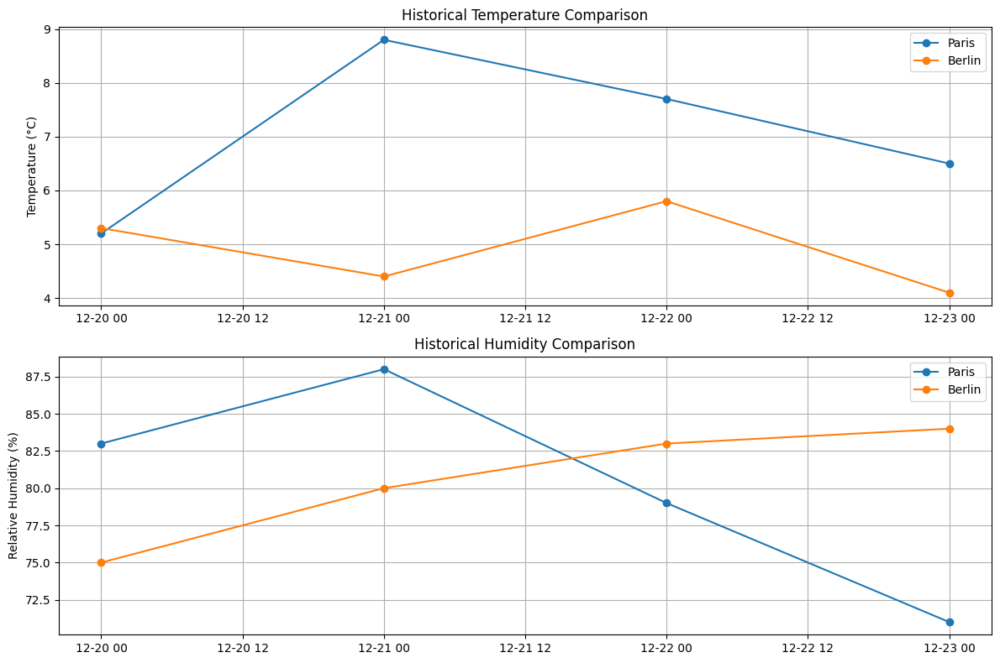

# Custom skills

This tutorial demonstrates how to develop and use custom skills through two examples: first creating a weather reporting skill from scratch, and then using that skill to generate weather comparisons and visualizations.

!!! Tip "Prerequisites"
    It is recommended to complete the [Basic Usage](basics.md) tutorial before proceeding with this one, as it covers fundamental concepts that are built upon here.

## Skill development

This section demonstrates the interactive development of a custom weather reporting skill through a conversation between a user and a `freeact` agent. You'll see how the agent assists with software engineering tasks, evolving a simple weather query into a Python package that can:

- Fetch current weather conditions for any city
- Resolve city names to geographical coordinates
- Retrieve historical weather data
- Return structured data for both current and historical weather

The development progresses through several iterations:

1. Creating a code action to fetch Vienna's weather
2. Converting it into a proper Python package
3. Adding city name resolution
4. Incorporating historical weather data
5. Testing with various cities (New York, Vienna, Salzburg)

The interactively developed `weather.weather_report` (1) skill uses the Open-Meteo API for weather data and OpenStreetMap's Nominatim service for geocoding.
{ .annotate }

1. 
```python
--8<-- "docs/workspace/skills/private/example/weather/weather_report.py"
```

!!! Note
    Interactive skill development is currently only supported for [Claude][freeact.model.claude.model.Claude] models.

The conversation below was initiated with the following `freeact.cli` command[^1]. The developed `weather.weather_report` skill is written to the `workspace/skills/private/example` directory.

[^1]: The provided skill modules are not needed in this example but included to demonstrate that their usage is optional.

```shell
--8<-- "freeact/examples/commands.txt:cli-skills"
```


> `User message: ('q' to quit)` get the current temperature and humidity in vienna, also show the measurement time

`...` (1)
{ .annotate }

1.  `Agent response:`

    &lt;thinking&gt;  
    To get current weather data for Vienna, I'll use the open-meteo API which provides free weather data. I'll use Python's requests library to make the API call and get real-time data.

    Steps:

    1. Use the open-meteo API to get current weather for Vienna (coordinates: 48.21°N, 16.37°E)
    2. Extract temperature, humidity and current time from the response
    3. Format and display the results

    &lt;/thinking&gt;

    ```python
    import requests
    from datetime import datetime

    # Make API call to open-meteo
    url = "https://api.open-meteo.com/v1/forecast?latitude=48.21&longitude=16.37&current=temperature_2m,relative_humidity_2m&timezone=Europe/Vienna"
    response = requests.get(url)
    data = response.json()

    # Extract current weather data
    current = data['current']
    temp = current['temperature_2m']
    humidity = current['relative_humidity_2m']
    time = datetime.fromisoformat(current['time'])

    print(f"Current weather in Vienna:")
    print(f"Temperature: {temp}°C")
    print(f"Relative Humidity: {humidity}%")
    print(f"Measurement time: {time.strftime('%Y-%m-%d %H:%M:%S')}")
    ```

    `Execution result:`

    Current weather in Vienna:  
    Temperature: 2.9°C  
    Relative Humidity: 74%  
    Measurement time: 2024-12-24 06:30:00


> `Agent response:`
>
> Based on the current weather data from Vienna, Austria:
>
> - Temperature: 2.9°C
> - Relative Humidity: 74%
> - Measurement time: December 24, 2024 at 06:30:00 local time
>
> The data was retrieved in real-time from the Open-Meteo weather API.
<!-- -->
> `User message: ('q' to quit)` save this to a function get_weather_report that returns these data as dict and additionally resolves coordinates for a given city_name argument. Create a package weather and save the function to weather_report.py in that package

`...` (1)
{ .annotate }

1.  `Agent response:`

    &lt;thinking&gt;  
    I'll help create a weather package with the weather reporting functionality. Here's what I'll do:

    1. Create a package directory 'weather'
    2. Create an __init__.py to make it a proper package
    3. Create weather_report.py with the function that:
        - Takes a city name as input
        - Uses geocoding to get coordinates
        - Gets weather data
        - Returns a dictionary with the results
    4. I'll use the geocoding API from nominatim.openstreetmap.org for coordinates

    &lt;/thinking&gt;

    ```python
    print(file_editor(**{'command': 'create', 'path': 'weather/__init__.py', 'file_text': '... omitted ...'}))
    ```

    `Execution result:`

    File created successfully at: weather/__init__.py

    `Agent response:`

    ```python
    print(file_editor(**{'command': 'create', 'path': 'weather/weather_report.py', 'file_text': '... omitted ...'}))
    ```

    `Execution result:`

    File created successfully at: weather/weather_report.py

    `Agent response:`

    Let's test the new package to make sure it works:

    ```python
    from weather import get_weather_report

    # Test the function with Vienna
    report = get_weather_report('Vienna')

    print(f"Weather report for {report['city']}:")
    print(f"Coordinates: {report['coordinates']}")
    print(f"Temperature: {report['temperature']}°C")
    print(f"Relative Humidity: {report['humidity']}%")
    print(f"Measurement time: {report['measurement_time'].strftime('%Y-%m-%d %H:%M:%S')}")
    ```

    `Execution result:`

    Weather report for Vienna:  
    Coordinates: (48.2083537, 16.3725042)  
    Temperature: 2.9°C  
    Relative Humidity: 74%  
    Measurement time: 2024-12-24 06:30:00


> `Agent response:`

> I've created a weather package with the following structure:
>
> ```
> weather/
>     __init__.py
>     weather_report.py
> ```
>
> The package provides a `get_weather_report()` function that:
>
> 1. Takes a city name as input
> 2. Resolves coordinates using OpenStreetMap's Nominatim geocoding service
> 3. Fetches weather data from Open-Meteo API
> 4. Returns a dictionary with temperature, humidity, measurement time, city name, and coordinates
>
> As shown in the test, the function works correctly for Vienna and can be used for any city. The package can be imported with `from weather import get_weather_report`.
<!-- -->
> `User message: ('q' to quit)` test this for new york

`...` (1)
{ .annotate }

1.  `Agent response:`

    &lt;thinking&gt;  
    I'll test the weather reporting function for New York City using the newly created package.  
    &lt;/thinking&gt;

    ```python
    from weather import get_weather_report

    # Test the function with New York
    report = get_weather_report('New York')

    print(f"Weather report for {report['city']}:")
    print(f"Coordinates: {report['coordinates']}")
    print(f"Temperature: {report['temperature']}°C")
    print(f"Relative Humidity: {report['humidity']}%")
    print(f"Measurement time: {report['measurement_time'].strftime('%Y-%m-%d %H:%M:%S')}")
    ```

    `Execution result:`

    Weather report for New York:  
    Coordinates: (40.7127281, -74.0060152)  
    Temperature: -2.0°C  
    Relative Humidity: 73%  
    Measurement time: 2024-12-24 00:30:00


> The function works successfully for New York! Here's the current weather data:
>
> - Temperature: -2.0°C
> - Relative Humidity: 73%
> - Measurement time: December 24, 2024 at 00:30:00 local time
> - Location coordinates: (40.71°N, 74.01°W)
>
> Note that the measurement time is different from Vienna because it's automatically adjusted to New York's local timezone (which is several hours behind Vienna).
<!-- -->
> `User message: ('q' to quit)` extend the weather report to also return the temperature and humidity history over the past n days, excluding the current day.

`...` (1)
{ .annotate }

1.  `Agent response:`

    &lt;thinking&gt;  
    I'll modify the weather_report.py file to:

    1. Add a new parameter n_days for historical data
    2. Use the Open-Meteo API's historical weather data endpoint
    3. Return both current and historical data in the result dictionary
    4. Format historical data as a list of daily measurements

    &lt;/thinking&gt;

    ```python
    print(file_editor(**{'command': 'str_replace', 'path': 'weather/weather_report.py', 'old_str': '... omitted ...', 'new_str': '... omitted ...'}))
    ```

    `Execution result:`

    The file weather/weather_report.py has been edited. Here's the result of running `cat -n` on a snippet of weather/weather_report.py:
    ```
        1  """
        2  Weather reporting functionality using Open-Meteo API
        3  """
        4
        5  import requests
        6  from datetime import datetime, timedelta, date
        7  from typing import Dict, Any, List
        8
        9
        10  def get_coordinates(city_name: str) -> tuple[float, float]:
        11      """Get latitude and longitude for a given city name using Nominatim geocoding service."""
    ```
    Review the changes and make sure they are as expected. Edit the file again if necessary.

    `Agent response:`

    ```python
    print(file_editor(**{'command': 'str_replace', 'path': 'weather/weather_report.py', 'old_str': '... omitted ...', 'new_str': '... omitted ...'}))
    ```

    `Execution result:`

    The file weather/weather_report.py has been edited. Here's the result of running `cat -n` on a snippet of weather/weather_report.py:
    ```
        21      location = data[0]
        22      return float(location['lat']), float(location['lon'])
        23
        24
        25  def get_weather_report(city_name: str, n_days: int = 7) -> Dict[str, Any]:
        26      """
        27      Get current and historical weather report for a given city.
        28
        29      Args:
        30          city_name: Name of the city to get weather for
        31          n_days: Number of past days to get historical data for (excluding current day)
        32
        33      Returns:
        34          Dictionary containing:
        35          current:
        36              - temperature (float): Current temperature in Celsius
        37              - humidity (float): Current relative humidity in percent
        38              - measurement_time (datetime): Time of measurement
        39          historical:
        40              - dates (List[date]): List of dates
        41              - temperatures (List[float]): Daily average temperatures in Celsius
        42              - humidities (List[float]): Daily average relative humidities in percent
        43          metadata:
        44              - city (str): City name used in query
        45              - coordinates (tuple): (latitude, longitude) of the city
        46      """
        47      # Get coordinates for the city
        48      lat, lon = get_coordinates(city_name)
        49
        50      # Calculate date range for historical data
        51      end_date = date.today() - timedelta(days=1)  # yesterday
        52      start_date = end_date - timedelta(days=n_days-1)
        53
        54      # Make API call for current weather
        55      current_url = f"https://api.open-meteo.com/v1/forecast?latitude={lat}&longitude={lon}&current=temperature_2m,relative_humidity_2m&timezone=auto"
        56      current_response = requests.get(current_url)
        57      current_response.raise_for_status()
        58      current_data = current_response.json()
        59
        60      # Make API call for historical weather
        61      historical_url = f"https://api.open-meteo.com/v1/forecast?latitude={lat}&longitude={lon}&daily=temperature_2m_mean,relative_humidity_2m_mean&start_date={start_date}&end_date={end_date}&timezone=auto"
        62      historical_response = requests.get(historical_url)
        63      historical_response.raise_for_status()
        64      historical_data = historical_response.json()
        65
        66      # Extract current weather
        67      current = current_data['current']
        68
        69      # Extract historical weather
        70      daily = historical_data['daily']
        71
        72      return {
        73          'current': {
        74              'temperature': current['temperature_2m'],
        75              'humidity': current['relative_humidity_2m'],
        76              'measurement_time': datetime.fromisoformat(current['time'])
        77          },
        78          'historical': {
        79              'dates': [date.fromisoformat(d) for d in daily['time']],
        80              'temperatures': daily['temperature_2m_mean'],
        81              'humidities': daily['relative_humidity_2m_mean']
        82          },
        83          'metadata': {
        84              'city': city_name,
        85              'coordinates': (lat, lon)
        86          }
        87      }
    ```

    Review the changes and make sure they are as expected. Edit the file again if necessary.

    `Agent response:`

    Let's test the updated function with New York, getting 5 days of historical data:

    ```python
    from weather import get_weather_report

    # Test the function with New York, 5 days history
    report = get_weather_report('New York', n_days=5)

    # Print current weather
    print(f"Weather report for {report['metadata']['city']}:")
    print(f"Coordinates: {report['metadata']['coordinates']}")
    print("\nCurrent conditions:")
    print(f"Temperature: {report['current']['temperature']}°C")
    print(f"Relative Humidity: {report['current']['humidity']}%")
    print(f"Measurement time: {report['current']['measurement_time'].strftime('%Y-%m-%d %H:%M:%S')}")

    # Print historical data
    print("\nHistorical daily averages:")
    for date, temp, hum in zip(
        report['historical']['dates'],
        report['historical']['temperatures'],
        report['historical']['humidities']
    ):
        print(f"{date}: {temp:.1f}°C, {hum:.0f}% humidity")
    ```

    `Execution result:`

    Weather report for New York:  
    Coordinates: (40.7127281, -74.0060152)  

    Current conditions:  
    Temperature: -2.0°C  
    Relative Humidity: 73%  
    Measurement time: 2024-12-24 00:30:00  

    Historical daily averages:  
    2024-12-19: 4.9°C, 62% humidity  
    2024-12-20: 1.2°C, 78% humidity  
    2024-12-21: -2.0°C, 68% humidity  
    2024-12-22: -7.7°C, 48% humidity  
    2024-12-23: -6.7°C, 54% humidity


> `Agent response:`
>
> I've updated the weather reporting package to include historical data. The new function:
>
> 1. Takes an optional `n_days` parameter (defaults to 7) to specify how many days of historical data to retrieve
> 2. Returns a restructured dictionary with three main sections:
>
>     - `current`: Current weather conditions
>     - `historical`: Daily average temperatures and humidities for past days
>     - `metadata`: City information and coordinates
>
> The test results show both current conditions in New York and the daily averages for the past 5 days. The historical data shows an interesting cold spell with temperatures dropping from 4.9°C on December 19 to -7.7°C on December 22, with varying humidity levels.
>
> The function now provides a more comprehensive weather report that can be used to analyze both current conditions and recent weather patterns for any city.
<!-- -->
> `User message: ('q' to quit)` test it for salzburg

`...` (1)
{ .annotate }

1.  `Agent response:`

    &lt;thinking&gt;  
    I'll test the enhanced weather reporting function for Salzburg, Austria to get both current conditions and historical data.  
    &lt;/thinking&gt;

    ```python
    from weather import get_weather_report

    # Test the function with Salzburg, 5 days history
    report = get_weather_report('Salzburg', n_days=5)

    # Print current weather
    print(f"Weather report for {report['metadata']['city']}:")
    print(f"Coordinates: {report['metadata']['coordinates']}")
    print("\nCurrent conditions:")
    print(f"Temperature: {report['current']['temperature']}°C")
    print(f"Relative Humidity: {report['current']['humidity']}%")
    print(f"Measurement time: {report['current']['measurement_time'].strftime('%Y-%m-%d %H:%M:%S')}")

    # Print historical data
    print("\nHistorical daily averages:")
    for date, temp, hum in zip(
        report['historical']['dates'],
        report['historical']['temperatures'],
        report['historical']['humidities']
    ):
        print(f"{date}: {temp:.1f}°C, {hum:.0f}% humidity")
    ```

    `Execution result:`

    Weather report for Salzburg:  
    Coordinates: (47.7981346, 13.0464806)

    Current conditions:  
    Temperature: 1.0°C  
    Relative Humidity: 92%  
    Measurement time: 2024-12-24 06:30:00

    Historical daily averages:  
    2024-12-19: 6.3°C, 81% humidity  
    2024-12-20: 2.5°C, 82% humidity  
    2024-12-21: 2.3°C, 67% humidity  
    2024-12-22: 3.9°C, 80% humidity  
    2024-12-23: 1.1°C, 85% humidity

> `Agent response:`
>
> The weather report for Salzburg shows:
>
> Current conditions:
>
> - Temperature: 1.0°C
> - Relative Humidity: 92%
> - Measurement time: December 24, 2024 at 06:30:00 local time
> - Location coordinates: (47.80°N, 13.05°E)

> Historical daily averages over the past 5 days:
>
> - Dec 19: 6.3°C, 81% humidity
> - Dec 20: 2.5°C, 82% humidity
> - Dec 21: 2.3°C, 67% humidity
> - Dec 22: 3.9°C, 80% humidity
> - Dec 23: 1.1°C, 85% humidity
>
> The data shows that Salzburg has experienced relatively mild winter temperatures over the past few days, with a cooling trend from 6.3°C on December 19 to the current 1.0°C. The city consistently shows high humidity levels, typically above 80%, with the current humidity being particularly high at 92%.
<!-- -->
> `User message: ('q' to quit)` q

## Skill usage

This section demonstrates how to use the previously developed weather reporting skill in a separate conversation. After loading `weather.weather_report` as additional skill[^2], we'll see how the agent can:

- Create multi-city weather reports with much smaller code actions
- Create data visualizations comparing weather patterns
- Provide clear, natural language summaries of weather conditions

The example shows a request for weather data from Paris and Berlin, where the agent automatically:

1. Retrieves current conditions and 4-day history for both cities using the `weather.weather_report` skill
2. Creates comparative visualizations of temperature and humidity trends
3. Presents the data in both graphical and text formats

[^2]: We may automate this process in the future e.g. to load skill modules based on the details of a user's query.

The conversation was initiated with the following `freeact.cli` command. The developed skill is is read from `workspace/skills/private/example`. If we moved it to `workspace/skills/shared`, it would be available to all executors regardless of their `executor-key` value.

```shell
--8<-- "freeact/examples/commands.txt:cli-skills-weather"
```

> `User message: ('q' to quit)` report the weather of paris and berlin, with 4 days history

`...` (1)
{ .annotate }

1.  `Agent response:`

    &lt;thinking&gt;  
    I'll help you get weather reports for Paris and Berlin using the weather_report module. I'll:

    1. Get weather data for both cities using get_weather_report()
    2. Create a clear visualization comparing the temperatures and humidities
    3. Print the current conditions and show historical trends in a plot

    &lt;/thinking&gt;

    ```python
    import matplotlib.pyplot as plt
    from weather.weather_report import get_weather_report

    # Get weather data for both cities
    paris_weather = get_weather_report("Paris", n_days=4)
    berlin_weather = get_weather_report("Berlin", n_days=4)

    # Create a figure with two subplots
    fig, (ax1, ax2) = plt.subplots(2, 1, figsize=(12, 8))

    # Plot temperatures
    ax1.plot(paris_weather['historical']['dates'], paris_weather['historical']['temperatures'], 'o-', label='Paris')
    ax1.plot(berlin_weather['historical']['dates'], berlin_weather['historical']['temperatures'], 'o-', label='Berlin')
    ax1.set_ylabel('Temperature (°C)')
    ax1.set_title('Historical Temperature Comparison')
    ax1.grid(True)
    ax1.legend()

    # Plot humidities
    ax2.plot(paris_weather['historical']['dates'], paris_weather['historical']['humidities'], 'o-', label='Paris')
    ax2.plot(berlin_weather['historical']['dates'], berlin_weather['historical']['humidities'], 'o-', label='Berlin')
    ax2.set_ylabel('Relative Humidity (%)')
    ax2.set_title('Historical Humidity Comparison')
    ax2.grid(True)
    ax2.legend()

    plt.tight_layout()
    plt.show()

    # Print current conditions
    print("Current Weather Conditions:")
    print("\nParis:")
    print(f"Temperature: {paris_weather['current']['temperature']}°C")
    print(f"Humidity: {paris_weather['current']['humidity']}%")
    print(f"Measured at: {paris_weather['current']['measurement_time']}")

    print("\nBerlin:")
    print(f"Temperature: {berlin_weather['current']['temperature']}°C")
    print(f"Humidity: {berlin_weather['current']['humidity']}%")
    print(f"Measured at: {berlin_weather['current']['measurement_time']}")
    ```

    `Execution result:`

    &lt;Figure size 1200x800 with 2 Axes>Current Weather Conditions:

    Paris:  
    Temperature: 5.8°C  
    Humidity: 94%  
    Measured at: 2024-12-24 06:45:00

    Berlin:  
    Temperature: 3.3°C  
    Humidity: 89%  
    Measured at: 2024-12-24 06:45:00

    `Produced images:`

    \!\[image_0\](workspace/images/example/815afaa2.png)

> `Agent response:`
>
> I've retrieved and visualized the weather data for both Paris and Berlin. Here's the weather report:
>
> Current Conditions (as of December 24, 06:45):
>
> - Paris: 5.8°C with 94% humidity
> - Berlin: 3.3°C with 89% humidity
>
> I've created a visualization showing the historical temperature and humidity trends for the past 4 days for both cities. The graphs show:
>
> 1. Temperature comparison (top graph): Shows how temperatures have varied in both cities over the past 4 days
> 2. Humidity comparison (bottom graph): Shows the relative humidity trends for both cities
>
> As we can see from the data:
>
> - Paris is currently slightly warmer than Berlin
> - Both cities are experiencing high humidity levels
> - The historical trends show the temperature and humidity variations over the past few days, which you can observe in the graphs above
>
> The visualization allows you to see how the weather patterns have evolved and compare the conditions between the two cities.
>
> `Produced images:`
>
> [{ width="50%" }](../workspace/images/example/815afaa2.png){target="_blank"}

---

...
