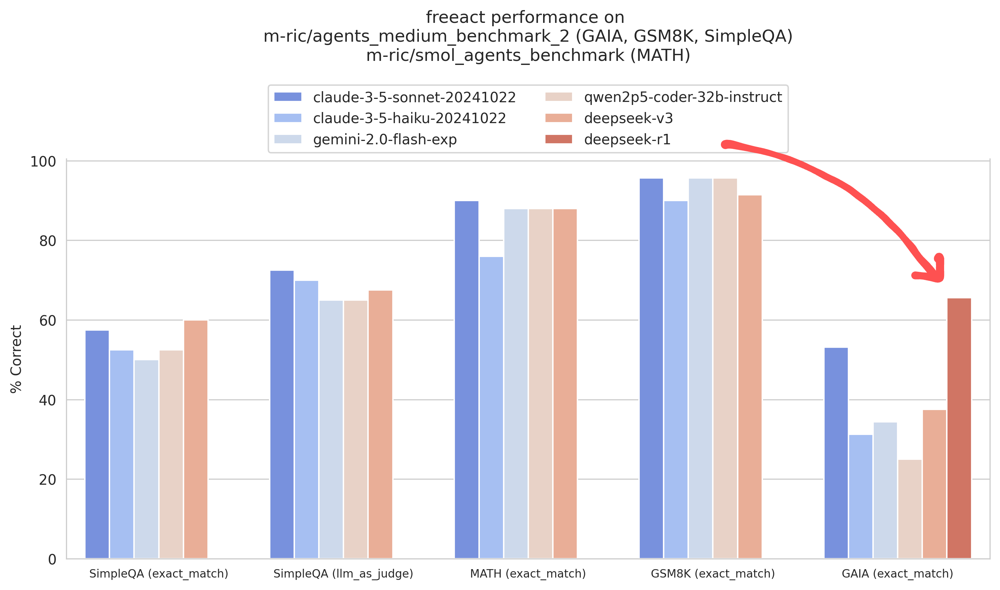

# Evaluation

We evaluated `freeact` with the following models:

- Claude 3.5 Sonnet (`claude-3-5-sonnet-20241022`)
- Claude 3.5 Haiku (`claude-3-5-haiku-20241022`)
- Gemini 2.0 Flash (`gemini-2.0-flash-exp`)
- Qwen 2.5 Coder 32B Instruct (`qwen2p5-coder-32b-instruct`)
- DeepSeek V3 (`deepseek-v3`)
- DeepSeek R1 (`deepseek-r1`)

The evaluation uses two datasets:

1. [m-ric/agents_medium_benchmark_2](https://huggingface.co/datasets/m-ric/agents_medium_benchmark_2)
2. [m-ric/smol_agents_benchmark](https://huggingface.co/datasets/m-ric/smol_agents_benchmark)

Both datasets were created by the [smolagents](https://github.com/huggingface/smolagents) team at 🤗 Hugging Face and contain curated tasks from GAIA, GSM8K, SimpleQA, and MATH. We selected these datasets primarily for a quick evaluation of relative performance between models in a `freeact` setup, with the additional benefit of enabling comparisons with smolagents. To ensure fair comparisons with [their published results](https://huggingface.co/blog/smolagents#how-strong-are-open-models-for-agentic-workflows), we used identical evaluation protocols and tools (implemented as [skills](skills)).

[](../docs/eval/eval-plot-line.png)

| model                        | GAIA (exact_match) | GSM8K (exact_match) | MATH (exact_match) | SimpleQA (exact_match) | SimpleQA (llm_as_judge) |
|:----------------------------|--------------------:|--------------------:|-------------------:|-----------------------:|------------------------:|
| claude-3-5-sonnet-20241022  |                53.1 |            **95.7** |           **90.0** |                  57.5  |                **72.5** |
| claude-3-5-haiku-20241022   |                31.2 |                90.0 |               76.0 |                  52.5  |                   70.0  |
| gemini-2.0-flash-exp        |                34.4 |            **95.7** |               88.0 |                  50.0  |                   65.0  |
| qwen2p5-coder-32b-instruct  |                25.0 |            **95.7** |               88.0 |                  52.5  |                   65.0  |
| deepseek-v3                 |                37.5 |                91.4 |               88.0 |               **60.0** |                   67.5  |
| deepseek-r1                 |            **65.6** |                     |                    |                        |                         |

When comparing our results with smolagents using `claude-3-5-sonnet-20241022` on [m-ric/agents_medium_benchmark_2](https://huggingface.co/datasets/m-ric/agents_medium_benchmark_2) (only dataset with available smolagents [reference data](https://github.com/huggingface/smolagents/blob/c22fedaee17b8b966e86dc53251f210788ae5c19/examples/benchmark.ipynb)), we observed the following outcomes (comparison executed on 2025-01-07):

[](../docs/eval/eval-plot-comparison.png)

| agent      | model                      | prompt    | GAIA      | GSM8K     | SimpleQA  |
|:-----------|:---------------------------|:----------|----------:|----------:|----------:|
| freeact    | claude-3-5-sonnet-20241022 | zero-shot |  **53.1** |  **95.7** |  **57.5** |
| smolagents | claude-3-5-sonnet-20241022 | few-shot  |      43.8 |      91.4 |      47.5 |

Interestingly, these results were achieved using zero-shot prompting in `freeact`, while the smolagents implementation utilizes few-shot prompting.

## Running

Clone the `freeact` repository:

```bash
git clone https://github.com/freeact/freeact.git
```

Set up the development environment following [DEVELOPMENT.md](../DEVELOPMENT.md), but use this installation command:

```bash
poetry install --with eval
```

Create a `.env` file with [Anthropic](https://console.anthropic.com/settings/keys), [Gemini](https://aistudio.google.com/app/apikey), [Fireworks AI](https://fireworks.ai/account/api-keys) [SerpAPI](https://serpapi.com/dashboard) and [OpenAI](https://platform.openai.com/settings/organization/api-keys) API keys:

```env title=".env"
# Claude 3.5 Sonnet and Haiku
ANTHROPIC_API_KEY=...

# Gemini 2 Flash Experimental
GOOGLE_API_KEY=...

# Qwen 2.5 Coder 32B Instruct and DeepSeek V3
FIREWORKS_API_KEY=...

# Google Web Search
SERPAPI_API_KEY=...

# GPT-4 Judge (SimpleQA evaluation)
OPENAI_API_KEY=...
```

Then run the evaluation script for each model:

```bash
python evaluation/evaluate.py \
    --model-name claude-3-5-sonnet-20241022 \
    --run-id claude-3-5-sonnet-20241022

python evaluation/evaluate.py \
    --model-name claude-3-5-haiku-20241022 \
    --run-id claude-3-5-haiku-20241022

python evaluation/evaluate.py \
    --model-name gemini-2.0-flash-exp \
    --run-id gemini-2.0-flash-exp

python evaluation/evaluate.py \
    --model-name qwen2p5-coder-32b-instruct \
    --run-id qwen2p5-coder-32b-instruct

python evaluation/evaluate.py \
    --model-name deepseek-v3 \
    --run-id deepseek-v3

python evaluation/evaluate.py \
    --model-name deepseek-r1 \
    --run-id deepseek-r1
```

Results are saved in `output/evaluation/<run-id>`. Pre-generated outputs from our runs are available [here](https://github.com/user-attachments/files/18488186/evaluation-results-agents-4_medium_benchmark_2.zip).

## Analysis

Score the results:

```bash
python evaluation/score.py \
  --evaluation-dir output/evaluation/claude-3-5-sonnet-20241022 \
  --evaluation-dir output/evaluation/claude-3-5-haiku-20241022 \
  --evaluation-dir output/evaluation/gemini-2.0-flash-exp \
  --evaluation-dir output/evaluation/qwen2p5-coder-32b-instruct \
  --evaluation-dir output/evaluation/deepseek-v3 \
  --evaluation-dir output/evaluation/deepseek-r1
```

Generate visualization and reports:

```bash
python evaluation/report.py performance

python evaluation/report.py performance-comparison \
  --model-name claude-3-5-sonnet-20241022 \
  --reference-results-file evaluation/reference/agents_medium_benchmark_2/smolagents-20250107.csv

python evaluation/report.py performance-comparison \
  --model-name qwen2p5-coder-32b-instruct \
  --reference-results-file evaluation/reference/agents_medium_benchmark_2/smolagents-20250107.csv
```

Plots are saved to `output/evaluation-report`.
