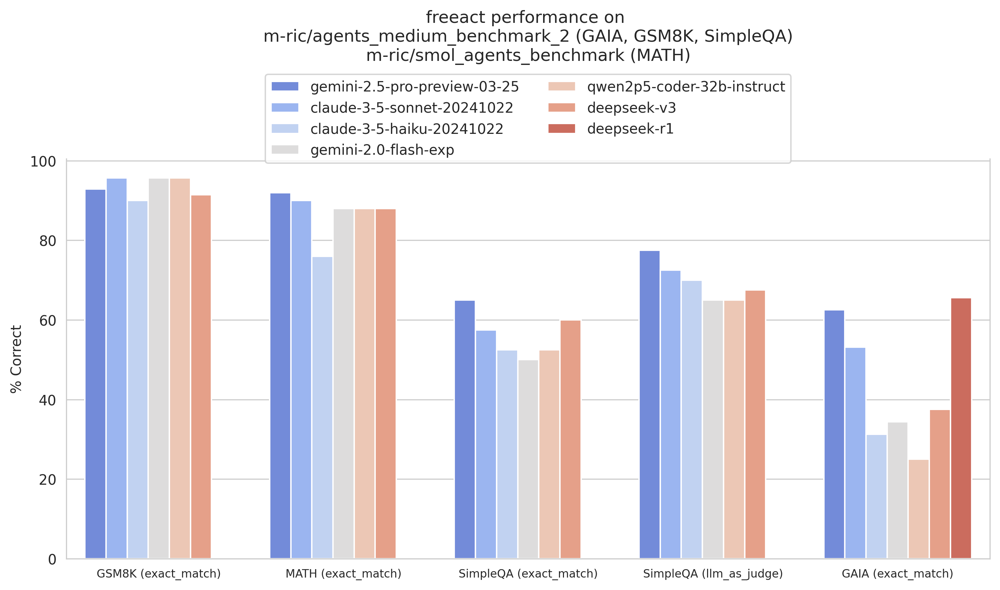
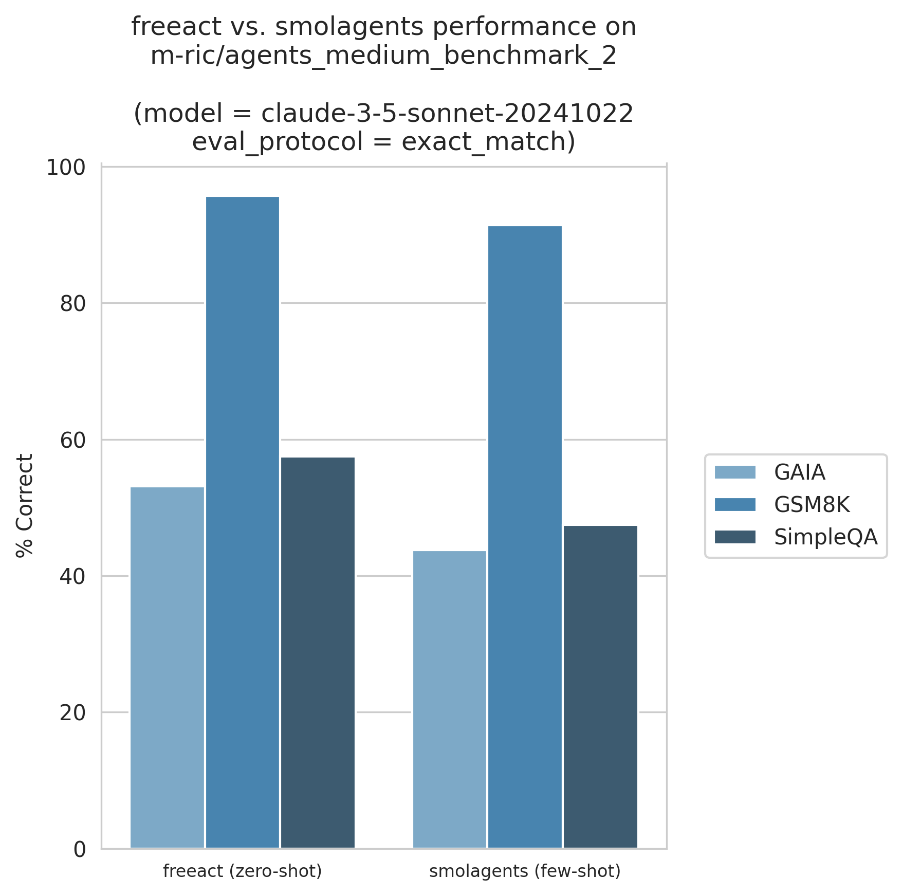

# Evaluation

We evaluated `freeact` using three state-of-the-art models:

- `claude-3-5-sonnet-20241022`
- `claude-3-5-haiku-20241022`
- `gemini-2.0-flash-exp`

The evaluation was performed on the [m-ric/agents_medium_benchmark_2](https://huggingface.co/datasets/m-ric/agents_medium_benchmark_2) dataset, developed by the [smolagents](https://github.com/huggingface/smolagents) team at 🤗 Hugging Face. It comprises selected tasks from GAIA, GSM8K, and SimpleQA:

[](../docs/eval/eval-plot.png)

| model                      | subset   | eval_protocol   | % correct |
|:---------------------------|:---------|:----------------|----------:|
| claude-3-5-sonnet-20241022 | GAIA     | exact_match     |  **53.1** |
| claude-3-5-sonnet-20241022 | GSM8K    | exact_match     |  **95.7** |
| claude-3-5-sonnet-20241022 | SimpleQA | exact_match     |  **57.5** |
| claude-3-5-sonnet-20241022 | SimpleQA | llm_as_judge    |  **72.5** |
| claude-3-5-haiku-20241022  | GAIA     | exact_match     |      31.2 |
| claude-3-5-haiku-20241022  | GSM8K    | exact_match     |      90.0 |
| claude-3-5-haiku-20241022  | SimpleQA | exact_match     |      52.5 |
| claude-3-5-haiku-20241022  | SimpleQA | llm_as_judge    |      70.0 |
| gemini-2.0-flash-exp       | GAIA     | exact_match     |      34.4 |
| gemini-2.0-flash-exp       | GSM8K    | exact_match     |  **95.7** |
| gemini-2.0-flash-exp       | SimpleQA | exact_match     |      50.0 |
| gemini-2.0-flash-exp       | SimpleQA | llm_as_judge    |      65.0 |

When comparing our results with smolagents using `claude-3-5-sonnet-20241022`, we observed the following outcomes (evaluation conducted on 2025-01-07, reference data [here](https://github.com/huggingface/smolagents/blob/c22fedaee17b8b966e86dc53251f210788ae5c19/examples/benchmark.ipynb)):

[](../docs/eval/eval-plot-comparison.png)

| agent      | model                      | prompt    | subset   | %correct |
|:-----------|:---------------------------|:----------|:---------|----------:|
| freeact    | claude-3-5-sonnet-20241022 | zero-shot | GAIA     |  **53.1** |
| freeact    | claude-3-5-sonnet-20241022 | zero-shot | GSM8K    |  **95.7** |
| freeact    | claude-3-5-sonnet-20241022 | zero-shot | SimpleQA |  **57.5** |
| smolagents | claude-3-5-sonnet-20241022 | few-shot  | GAIA     |      43.8 |
| smolagents | claude-3-5-sonnet-20241022 | few-shot  | GSM8K    |      91.4 |
| smolagents | claude-3-5-sonnet-20241022 | few-shot  | SimpleQA |      47.5 |

Interestingly, these results were achieved using zero-shot prompting in `freeact`, while the smolagents implementation utilizes few-shot prompting. To ensure a fair comparison, we employed identical evaluation protocols and tools (converted to [skills](skills)).

## Running

Clone the `freeact` repository:

```bash
git clone https://github.com/freeact/freeact.git
```

Set up the development environment following [DEVELOPMENT.md](../DEVELOPMENT.md), but use this installation command:

```bash
poetry install --with eval
```

Create a `.env` file with [Anthropic](https://console.anthropic.com/settings/keys), [Gemini](https://aistudio.google.com/app/apikey), [SerpAPI](https://serpapi.com/dashboard) and [OpenAI](https://platform.openai.com/settings/organization/api-keys) API keys:

```env title=".env"
# Claude 3.5 Sonnet and Haiku
ANTHROPIC_API_KEY=...

# Gemini 2 Flash Experimental
GOOGLE_API_KEY=...

# Google Web Search
SERPAPI_API_KEY=...

# GPT-4 Judge (SimpleQA evaluation)
OPENAI_API_KEY=...
```

Then run the evaluation script with a model name and a `run-id` as arguments:

```bash
python evaluation/evaluate.py \
    --model-name claude-3-5-sonnet-20241022 \
    --run-id claude-3-5-sonnet-20241022

python evaluation/evaluate.py \
    --model-name claude-3-5-haiku-20241022 \
    --run-id claude-3-5-haiku-20241022

python evaluation/evaluate.py \
    --model-name gemini-2.0-flash-exp \
    --run-id gemini-2.0-flash-exp

python evaluation/evaluate.py \
    --model-name qwen2p5-coder-32b-instruct \
    --run-id qwen2p5-coder-32b-instruct \
    --subset GAIA

python evaluation/evaluate.py \
    --model-name qwen2p5-coder-32b-instruct \
    --run-id qwen2p5-coder-32b-instruct \
    --subset SimpleQA

python evaluation/evaluate.py \
    --model-name qwen2p5-coder-32b-instruct \
    --run-id qwen2p5-coder-32b-instruct \
    --subset GSM8K
```

Results are saved in `output/evaluation/<run-id>`. Pre-generated outputs from our runs are available [here](https://github.com/user-attachments/files/18433107/evaluation-results-agents-2_medium_benchmark_2.zip).

## Analysis

Score the results:

```bash
python evaluation/score.py \
  --evaluation-dir output/evaluation/claude-3-5-sonnet-20241022 \
  --evaluation-dir output/evaluation/claude-3-5-haiku-20241022 \
  --evaluation-dir output/evaluation/gemini-2.0-flash-exp

python evaluation/score.py \
  --evaluation-dir output/evaluation/qwen2p5-coder-32b-instruct
```

Generate visualization and reports:

```bash
python evaluation/report.py performance

python evaluation/report.py performance-comparison \
  --reference-results-file evaluation/reference/agents_medium_benchmark_2/smolagents-20250107.csv
```

Plots are saved to `output/evaluation-report`.
